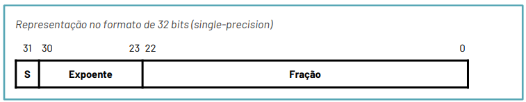
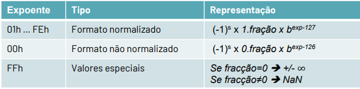

# Representação de números

## Operandos com sinal

### Sinal e módulo

$x=x7.x6.x5.x4.x3.x2.x1.x0$

- O sinal é o bit mais significativo $x7$.
- O módulo são os restantes bits $x6.x5.x4.x3.x2.x1.x0$.
- A representação do número $y = -x$ é realizada complementado o bit de sinal.
- Existem dois zeros $0^+$ e $0^-$.

### Complemento para um

$x=x7.x6.x5.x4.x3.x2.x1.x0$

- O sinal é o bit mais significativo $x7$.
- Se $x7$ for posito, então oss restantes bits representam o módulo.
- Se $x7$ for negativo, os restantes bits representam o complemento do módulo.
- A representação do número $-x$ é realizada complementando todos os bits do número, isto é:
  $\bar{x7}.\bar{x6}.\bar{x5}.\bar{x4}.\bar{x3}.\bar{x2}.\bar{x1}.\bar{x0}$
- Existem dois zeros $0^+$ e $0^-$.

### Complemento para dois

$x=x7.x6.x5.x4.x3.x2.x1.x0$

- O sinal é o bit mais significativo $x7$.
- Se $x7$ for posito, então oss restantes bits representam o módulo.
- Se $x7$ for negativo, os restantes bits representam o complemento do módulo mais 1.
- A representação $-x$ é realizada complementando todos os bits do número a que se soma um valor, isto é $-x = \bar{x} + 1$
- Só existe um zero mas a gama dos números negativos é maior que a gama dos números positivos.

## Tipos de Operandos

- Byte $\rightsquigarrow$ 8 bits (1 byte);
- Half Word $\rightsquigarrow$ 16 bits (2 bytes);
- Word $\rightsquigarrow$ 32 bits (4 bytes);
- Double Word $\rightsquigarrow$ 64 bits (8 bytes);
- Quad Word $\rightsquigarrow$ 128 bits (16 bytes);

## Operações Aritméticas

### Soma/subtração

Geralmente os números inteiros com sinal são representados em formato de complemento para dois, visto que facilita a implementação do somador.

- Flags

1. Carry (C) = $C_8$;
2. Zero (Z): Z = 1 se o resultado for zero, 0 se o resultado não for 0;
3. Negative (N) = $S_8$;
4. Overflow (V) = $C_8 \oplus C_7$

### Multiplicação

O produto de dois números com $n$ e $m$ bits, respetivamente, resulta num número contido em $n + m$ bits.
$8 bits \times 8 bits \rightsquigarrow\ 16 bits$.

Para realizar um produto em números com sinal, primeiro deve-se estender ambos os operando de forma a prefazer o número de bits usado no resultado. A operação da multiplicação de números, no pior dos casos, usa uma cadeia de somadores igual ao número de bits do resultado.

### Divisão

A operação da divisão é bastante mais complexa, envolvendo operações encadeadas. Embora existam vários algoritmos para a implementação eficiente da divisão, como se verá mais à frente, o tempo de cálculo é sempre bastante superior ao de uma soma ou a de uma multiplicação.
Assim, é uma boa prática da programação, sempre que possível, evitar a utilização da operação da divisão. Por exemplo, se o divisor for uma potência de dois, pode e deve-se fazer um shift.

## Representação de números com virgula

### Virgula Fixa

- A virgula está numa posição fixa, mas apenas o programador sabe onde está. Para realizar uma operação, é necessário efetuar todas as normalizações e desnormalizações à mão. Utiliza-se frequentemente a nomenclatura da **Texas Instruments**, a qual assume números em complemento para dois.

::: tip

**Formato Qn** $\rightsquigarrow$ $n$ bits para a parte fracionária;

**Formato Qm.n** $\rightsquigarrow$ $m$ bits para a parte inteira, $n$ bits para a parte fracionária

:::

::: details Por exemplo

O número $011011.01_2 = 27,25$ está representado no formato $Q2$ ou $Q6.2$

O formato $Q6.2$ permite representar número na gama [-2^5, 2^5 -2^-2].

:::

Na prática, a representação indica que o operando pode ser representado como inteiro à parte de um fator de escala 2^-n.
Para realizar operações em virgula fixa é necessário ter em consideração os fatores de escala de cada um dos operandos, normalizandos-os (converter para o mesmo fator de escala) antes de efetuar uma operação.

#### Soma/subtração de operandos com o formato $Q_x$ e $Q_y$

1. Verificar qual dos números tem menor número de bits na parte inteira.
2. Ao operando escolhido em 1) fazer um _arithmetic shift right_ (complemento para 2) do módulo da diferença $|x-y|$
3. Somar ou subtrair os operandos

::: tip Por exemplo:

{green}(110101.10) + {blue}(1100.1110) $\to$ (110101.10 **ASR** 2) + 1100.1110 $\to$ 0101.1000 + 1100.1110 $\to$ 10010.0110

**NOTA:**  
{green}(Formato Q2)  
{blue}(Formato Q4)
:::

#### Produto de operandos com formato $Q_x$ e $Q_y$

- Não é necessário a normalização
- O formato está no formato $Q_x+y$

::: tip Por exemplo:

110101.10 x 1100.1110 =
(11010110 x 2^-2) x (11001110 x 2^-4) =

11010110 x (11001110 x 2^-6) =

(000 1000 0011 0100) x 2^-6=

0000 100000.110100 $\rightsquigarrow$ $Q6$

:::

### Virgula Flutuante

Suporta números em que a vírgula não está fixa tal como é para os inteiros. Em C, usamos o nome de _float_ para definir estes números.  
Semelhante à notação científica, os números estão representados como um único dígito diferente de 0 à esquerda da vírgula binária.

- Norma IEEE 754
  - Base b, 2 ou 10;
  - Mantissa (m), a qual é sempre representada no formato $1.xxx$;
  - Expoente (e);
  - Sinal (s);
  - Representa o número: $(-1)^5 \times m \times b^e$

#### Fração

Como a mantissa começa com $1.xxx$, não precisamos de escrever o $1.$ no campo de fração. Assim, existe sempre um 1 "escondido" que não é representado na fração.

#### Expoente

O expoente é representado com um offset: 127

