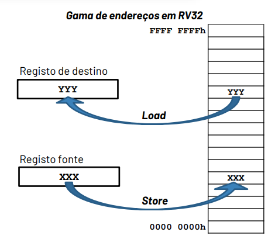
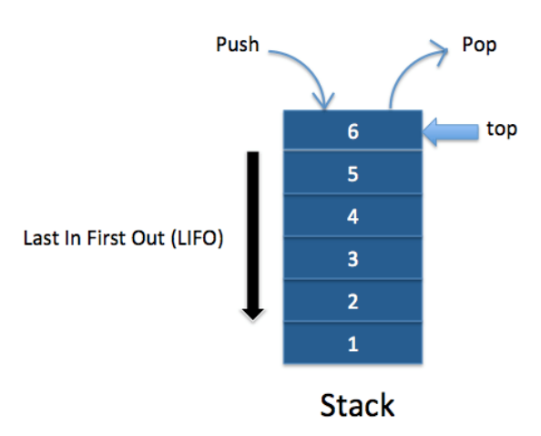
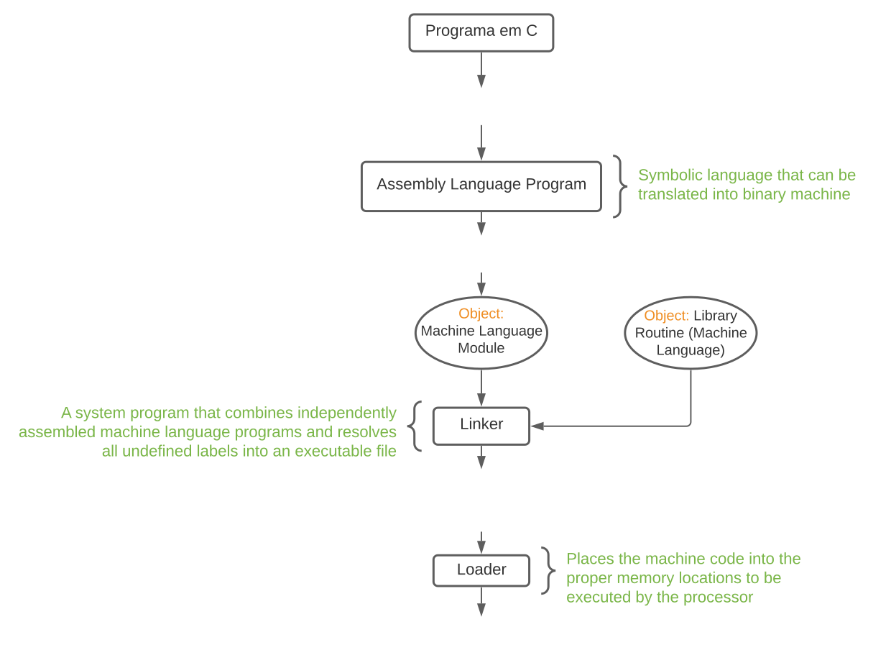

# Compilação e execução de código

## Instruction Set Architecture (ISA)

- Modelo abstrato de uma arquitetura de processador
- Define o conjunto de instruções disponíveis
- Estabelece o funcionamento lógico do processador, e desta forma o interface entre o software e o hardware
- Permite múltiplas realizações (ex: diferentes modelos de processadores da Intel), cada uma com desempenhos diferentes.

1. [Define as instruções disponíveis-RiscV](https://drive.google.com/file/d/1a4tSO8MrOxcFGxrdwuO_4-0-kBs3Ol3Q/view?usp=sharing)
2. Define os operandos;
3. Define a forma como se acede à memória e aos periféricos:
   - Instruções dedicadas de acesso à memória (load/store), ou diretamente como um operando de qualquer instrução.
   - Barramento dedicado de acesso aos periféricos (instruções específicas) ou diretamente mapeados numa zona de memória.
4. Define a forma como se tratam exceções e interrupções
   - **Interrupção**: ocorrência de um sinal externo ao processador _(ex: o utilizador pressiona uma tecla do teclado)_;
   - **Exceção**: ocorrência de um evento especial não programado durante a execução de um programa _(ex: divisão por zero)_

## Execução do programa

- Sistema Operativo:

  - Gestão das entradas e saídas;
  - Gestão da memória (RAM e disco), incluindo inicialização das estruturas de dados necessárias para começar a executar o programa;
  - Escaloamento da execução das tarefas e gestão dos recursos partilhados.

- Hardware:
  - Processador, memória, controladores I/O.

## RISC-V

- O RISC-V contém:
  - 32 registos inteiros (x0,x1,...,x31);
  - 32 registos para virgula flutuante (f0,...f31)- se a extensão de floating point estiver ativa
  - Dependendo da implementação, os registos podem ser de 32 ou 64 bits.
  - O registo x0 vale sempre 0 (mesmo após uma escrita nesse registo)

::: details Por exemplo:

```asm6502
add x10, x12, x13 #soma a com b e coloca em x

add x11, x14, x15 #soma c e d

sub x10, x10, x11 #calcula o resultado (a+b)-(c+d)
```

:::

## Instruções de acesso à memória

- {pink}(**Memória**): Conjunto de gavetas númeradas de 00...00h a FF...FFh (endereço).

- {orange}(**Operações**):
  - **Load registo, endereço**: Leitura do valor em memória, no endereço indicado, e escrita no registo.
  - **Store registo, endereço**: Escrita do valor armazenado no registo em memória (no endereço indicado).



A {pink}(**memória**) é endereçável ao byte (caso típico).
Operandos com dimensões superiores a um byte ocupam várias posições na memória.
O alinhamento dos dados em memória é garantido colocando os **m** bits menos significativos do endereço a zero, onde **m** é calculado como:

$$m=log_2 \frac {\text {dimensão da variável}} {\text {dimensão da palavra de memória}}$$

::: details Exemplo de acesso à memória

```asm6502

la x1,0x2a    #pseudo-instrução
lb x2,3(x1)   # x2 = FFFF FFBBh
lb x13,-3(x1) # x3 = 0000 0053h
lbu x4,3(x1)  # 0000 00BBh

sb x4,-1(x1)  # guarda os 8 bits menos significativos de x4 no endereço 29h da memória.

```

:::

::: details Cópia de lista de valores

Considere uma lista de palavras (32 bits), armazenada em memória. Escreva o código que copia os 4 elementos para a zona de outra lista de valores.

Lista1=100h $\rightsquigarrow$ {-1127,+3401,1457,-4832}

Lista2=200h $\rightsquigarrow$ {...}

```asm6502
la x10, lista1
                #Na prática diz-se que x10 e x11 são ponteiros para a Lista1 e Lista2 (guardam o endereço do primeiro elemento da lista)
la x11, lista2

lw x12, 0(x10)
sw x12, 0(x11)

lw x12, 4(x10)
sw x12, 4(x11)

lw x12, 8(x10)
sw x12, 8(x11)

lw x12, 12(x10)
sw x12, 12x11)

```

:::

## Diretivas de Assembler

As diretivas não são instruções, mas sim comandos para o Assembler gerar código binário

::: tip Diretivas

.text $\rightsquigarrow$ Declara uma zona de código (instruções)

.data $\rightsquigarrow$ Declara uma zona de dados **writable**

.zero N $\rightsquigarrow$ Declara um vetor de N bites inicializados a 0

.byte num1[,num2,...] $\rightsquigarrow$ Declara um vetor de bytes (1B) sequenciais em memória com valores num1, [num2,...]

.half num1[,num2,...] $\rightsquigarrow$ Declara um vetor de half (2B) sequenciais de memória

.word num1[,num2,...] $\rightsquigarrow$ Declara um vetor de words (4B) sequenciais de memória

.string "**list of characters**" Declara uma string em memória. Cada character (char) ocupa 8 bytes.

:::

::: details Por exemplo:

```asm6502
# Declaração de variáveis

.data

var1: .word 153
var2: .half -1227, 3443, 213, 0x14,13
str1: .string "cadeia de caractéres"

# Código

.text

la x1,var1
lw x2,0(x1)
loop: j loop

```

:::

## Controlo de Fluxo de Instruções

Cada instrução ocupa 4 bytes e, de maneira geral, a primeira está no endereço 0.
Por omissão, as operações são executadas por sequência.
Para que o processador saiba em que instrução se encontra, existe um registo que contém o endereço da instrução a executar: **Program Counter (PC)**

- **Ponto inicial**. quando se faz _reset_ ao processador coloca-se o PC=0, obrigando a executar a instrução armazenada na posição 0.
  Como cada instrução ocupa 4 bytes, o registo PC incrementa 4 cada vez que uma instrução é executada.

  ::: details Na prática:

  - Sempre que uma instrução é executada, o PC tem necessariamente de ser alterado.
  - Pode-se dizer que o PC é um ponteiro que aponta (guardar o endereço) para a próxima instrução a executar.
  - As instruções são sempre executadas em sequência, sem possibilidades de interromper o fluxo de instruções.

## Chamadas a funções e introdução à pilha

**Pilha**: Espaço reservado na memória para guardar dados temporários.
O acesso a este espaço de memória é feito segundo um política do tipo _"Last in, first out"_, isto é, o último elemento a entrar é o primeiro a sair.
Existem duas operações:

- {pink}(**PUSH**): Colocar um valor na pilha.
- {orange}(**POP**): Remover um valor da pilha.

Geralmente, a pilha é implementada no sentido de enderenços decrescentes. O stack pointer aponta para a última posição ocupada pela pilha.



1. **Implementar o PUSH**:

```asm6502
addi x2, x2, -12

sw x11, 8(x2)

sw x12, 4(x2) #x2 = sp (stack pointer)

sw x13, 0(x2)
```

2. **Implementar o POP**:

```asm6502
lw x11, 0(x2)

lw x12, 4(x2)

addi x2, x2, 8
```

## Código de chamada de uma função

1. Passagem de parâmetros de entrada (Alternativa a este método é a utilização de uma pilha);
2. Chamada da função - Existe uma instrução específica:

```asm6502
   jal x1, function (jal: jump and link)
```

- Esta função realiza:

  - Um salto _(Jump)_ para a função (Coloca o PC a apontar para a primeira instrução da função indicada).
  - Guarda _(Link)_ no registo x1 o endereço de retorno.
  - Por convenção do RISC-V, o registo de link é o **x1**.

3. Leitura dos parâmetros de entrada
4. Execução do traço de código.
5. Retorno do resultado

Como a chamada à função realizou a operação de _Link_ (salvaguarda do endereço de retorno), o retorno pode ser simplesmente realizado através da instrução:

```asm6502
    jalr x0, x1 ou ret
```

6. Retorno do fluxo de execução para o ponto original.
7. Leitura do resultado.

## Suporte do código para uma função

Em geral, a passagem de parâmetros e o retorno do resultado é realizado por registos, desde que haja registos em número suficiente. Se não houver, deve-se usar a {green}(pilha).  
Nesse caso, os parâmetros devem ser colocados na pilha {pink}(**antes**) da chamada à função, e retirados da pilha {orange}(**após**) a função.  
Adicionalmente, deve-se evitar que a função chamada altere os registos usados pela função/código base. Assim deve-se;

- {pink}(**Salvaguardar o contexto**): Guardar na pilha os valores originais de todos os registos que vão ser alterados pela função.
- {orange}(**Repor o contexto**): Antes da função terminar.

## Registos

Para evitar a salvaguarda de registos desnecessários, e simplificar o código, o compilador pode fazer convenções específicas.

{blue}(◉) x0 $\Rightarrow$ Constante = 0  
{blue}(◉) x1 $\Rightarrow$ Guarda o retorno da função.  
{blue}(◉) x2/sp $\Rightarrow$ Ultima posição do stack ocupada  
{blue}(◉) x3/x4 $\Rightarrow$ Usados pra facilitar o enderençamento. Podem usar livremente ou como registo temporário para enderençamento.  
{blue}(◉) Temporários $\Rightarrow$ Após uma chamada da função **M** main a função **f**, podem ter sido modificadas. Assim, se a função **M** necessita destes registos, têm de ser salvaguardados por esta antes de chamar **f** (e reposts após a chamada de **f**).  
{blue}(◉) Saved $\Rightarrow$ Registos que contêm variáveis da função **M**. Têm de ser preservados após uma chamada à função **f**. A salvaguarda é da responsabilidade da função **f**.

## Codificação das instruções

Em geral as instruções são codificadas numa palavra de instrução, correspondente à seguinte sequência de campos _(fields)_:

- **Opcode**: Código da operação a realizar
- **Operandos**: Identificação (número) dos registos fonte (source) e destino (destination) e/ou valor dos operandos imediatos (constantes codificadas imediatamente na palavra de instrução).
- **Outros**: Codifica outras opções das instruções.

Dependendo da ISA, o tamanho e ordem de cada um dos campos pode variar. No RISC-V a palavra de instrução tem tamanho fixo (4B).

## Compilação


