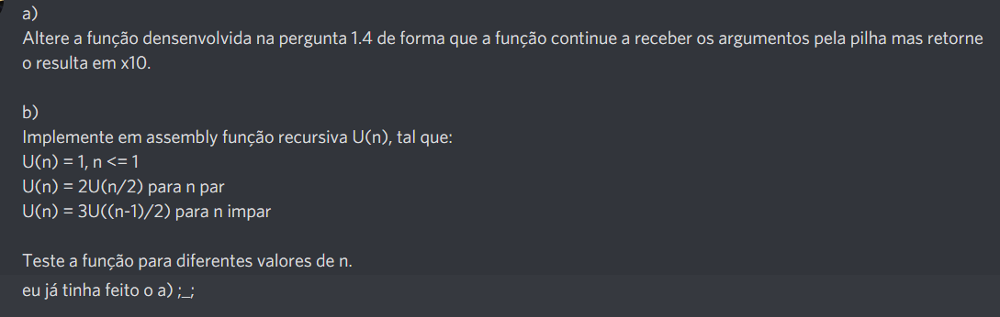
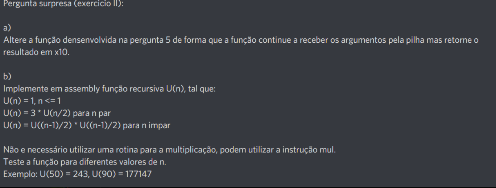

# Laboratório 3

## Exercico de casa

### by Martim Bento

::: details Resolução:

```asm6502
# ZONA I: Definicao de variaveis
.data
    x: .word 3
    y: .word 9

# ZONA II: Codigo
.text

# Programa principal: programa que recebe dois numeros inteiros positivos, x e y, e retorna o valor de x^y
    lw a0, x
    lw a1, y
    addi sp, sp, -8
    sw a0, 4(sp)
    sw a1, 0(sp)
    jal Pow
    lw a0, 0(sp)
    li a7, 1
    ecall

    li a7, 10
    ecall

# Pow: Rotina que efectua o calculo de x^y, sendo x e y dois numeros inteiros positivos
#     Entradas:     a0 - x
#                  a1 - y
#    Saidas:       a0 - resultado
#     Efeitos:      ---

Pow:

    #salvaguardar return address e s1
    addi sp, sp, -8
    sw ra, 4(sp)
    sw s1, 0(sp)

    lw t0, 8(sp) #t0 = y
    lw t3, 12(sp) #t3 = x
    srli t2, t0, 1

    beq t0, zero, ret1 #if y = 0 => pow(x,h) = 1

    li t1, 1
    beq t1, t0, impar #if y = 1 => return x*pow(x,h)
    andi t1, t0, 1
    blt zero, t1, impar #if y%2 = 1 => return x*pow(x,h)

par:
addi sp, sp, -8
sw t3, 4(sp)
sw t2, 0(sp)
jal Pow
lw s1, 0(sp)
addi sp, sp, -4
sw s1, 0(sp)
jal Mult
lw s1, 0(sp)
addi sp, sp, 4
j EndLoop

impar:
addi sp, sp, -8
sw t3, 4(sp)
sw t2, 0(sp)
jal Pow
lw s1, 0(sp)
addi sp, sp, -4
sw s1, 0(sp)
jal Mult
lw s1, 0(sp)
addi sp, sp, 4
addi sp, sp, -8
sw s1, 4(sp)
sw t3, 0(sp)
jal Mult
lw s1, 0(sp)
addi sp, sp, 4
j EndLoop


ret1:
li s1, 1 #pow(x,h) = 1
EndLoop:
    sw s1, 12(sp)

    lw s1, 0(sp)
    lw ra, 4(sp)
    addi sp, sp, 12
    ret

# Mult: Rotina que efectua o calculo de a*b, sendo a e b numeros inteiros positivos
#     Entradas:    0(sp), 4(sp) - numeros a multiplicar
#    Saidas:        0(sp) - resultado
#    Efeitos:    ---

Mult:
    addi sp, sp, -12
    sw s1, 8(sp)
    sw s2, 4(sp)
    sw s3, 0(sp)

    lw s2, 16(sp)
    lw s1, 12(sp)

    li s3, 0
    beq s2, zero, OutMul
    beq s1, zero, OutMul

MulLoop:
    add s3, s3, s1
    addi, s2, s2, -1
    bne s2, zero, MulLoop

OutMul:
    sw s3, 16(sp)

    lw s3, 0(sp)
    lw s2, 4(sp)
    lw s1, 8(sp)
    addi sp, sp, 16
    ret
```

:::

## Lab de Segunda feira - by Martim Bento



::: details Resolução

```asm6502
.data

n:    .word 10

    .text

    lw a0, n
    li s1, 0
    addi sp, sp, -8
    sw s1, 4(sp)
    sw a0, 0(sp)
    jal Un
    lw a0, 0(sp)
    li a7, 1
    ecall
    li a7, 10
    ecall

Un:
    addi sp, sp, -8
    sw ra, 4(sp)
    sw s1, 0(sp)
    lw t1, 8(sp) #t2 = x
    li t0, 1
    beq t1, t0, endrec

    andi t0, t1, 1
    bne t0, zero, impar
par:
srli t2, t1, 1 #t2 = n/2 = x
addi sp, sp -4
sw t2, 0(sp)
jal Un
lw s1, 0(sp)
li t3, 2
mul s1, s1, t3
j EndLoop

impar:
addi t2, t1, -1 #t2 = (n-1)/2 = x
srli t2, t1, 1
addi sp, sp -4
sw t2, 0(sp)
jal Un
lw s1, 0(sp)
li t3, 3
mul s1, s1, t3
j EndLoop

endrec:
li s1, 1
EndLoop:
sw s1, 12(sp)
lw s1, 0(sp)
lw ra, 4(sp)
addi sp, sp, 12
ret

```

:::

### by Martim Bento e João Rodrigues



::: details Resolução:

```asm6502
 .data

n:    .word 18
    .text

    lw a0, n
    li s1, 0
    addi sp, sp, -8
    sw s1,4(sp)
    sw a0,0(sp)
    jal Un

    lw a0, 0(sp)
    li a7, 1
    ecall
    li a7, 10
    ecall

Un:

    addi sp, sp, -8
    sw ra, 4(sp)
    sw s1, 0(sp)

    li t0, 1
    lw t1, 8(sp)
    bge t0, t1, endrec

    andi t0, t1, 1
    addi t0, t0, -1
    beq t0, zero, impar
par:
srai t2, t1, 1 #t2 = x = n/2
addi sp, sp, -4
sw t2, 0(sp)
jal Un
li t3, 2
lw s1, 0(sp)
mul s1, s1, t3 #2*U(n/2)
j EndLoop

impar:
addi t2, t1, -1
srai t2, t2, 1 #t2 = x = (n-1)/2
addi sp, sp, -4
sw t2, 0(sp)
jal Un
lw s1, 0(sp)
addi t3, s1, 0 #mv t3, s1
mul s1, s1, t3
j EndLoop

endrec:
li s1, 1
EndLoop:
    sw s1, 12(sp)

    lw s1, 0(sp)
    lw ra, 4(sp)
    addi sp, sp, 12
    ret
```

:::

## Lab de Sexta feira

### by Rodrigo Coimbra e André Teodósio

::: details Resolução:

```asm6502
# Programa L3 

#Exercicio:
#U(n) = 1, se n <= 1
#U(n) = U(n-1) * U(n/2), se n e par
#U(n) = 2 U((n-1)/2), se n e impar

# ZONA I: Definicao de variaveis
.data
    n: .word 14

# ZONA II: Codigo
.text

# Programa principal: programa que recebe dois numeros inteiros positivos, x e y, e retorna o valor de x^y
	lw a5, n
	addi sp, sp, -4
	sw a5, 0(sp)    #n
	jal U
	lw a0, 0(sp)
	li a7, 1
	ecall

	li a7, 10
	ecall


U:   
	addi sp, sp, -16
	sw s1, 12(sp) 
	sw ra, 8(sp)           
	sw a1, 4(sp)				  
	sw a0, 0(sp)				 

	lw a1, 16(sp)									
	
	li t1, 1
	bgt a1, t1, else1
	li a0, 1
	j end

else1:
	li t0, 2
	rem t4, a1, t0       #s4 = y%2
	bnez t4, else2    

	#par1    
   addi a1, a1, -1        #a2 = n-1
   
   addi sp, sp,-4        
	sw a1, 0(sp)                   
   jal U       
	lw a0, 0(sp)
	addi sp, sp, 4
	mv s1, a0

	#par2
   addi a1,a1,1  #meter o valor de n original, ou seja, (n-1)+1= n
	srli a1,a1,1  #a1 = n = (y/2)
   addi sp, sp, -4
	sw a1, 0(sp)                   
   jal U          
	lw a0, 0(sp) 
	addi sp, sp, 4
   mul a0,a0,s1

   j end

else2:                    
	#impar
	addi a1, a1, -1
	srli a1, a1, 1         #a1 = n = (y-1/2)
   addi sp, sp, -4      
	sw a1, 0(sp)            	       
   jal U        
	lw a0, 0(sp)
	addi sp, sp, 4
	li t2, 2            #para multiplicar por 2    
	mul a0, a0, t2        


end:
	sw a0, 16(sp)
	lw s1, 12(sp)
	lw ra, 8(sp)            
	lw a1, 4(sp)				  
	lw a0, 0(sp)		
	addi sp, sp, 16		
	jalr x0, ra, 0  
    
```
