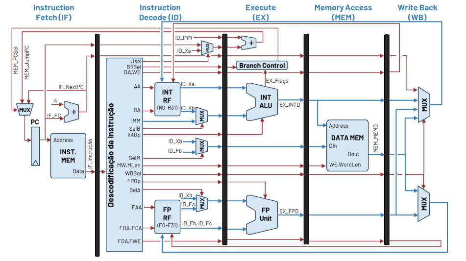

# Arquitetura do processador: Pipelining

Principais alterações:

1. Introdução de registos de pipeline entra estágios do processador.

{green}(Vantagens:) Redução do caminho critico $\to$ Período de relógio menor e maior frequência de relógio.

2. Os sinais devem atravessar os registos de pipeline: Cada sinal possui agora diversas designações dependendo dos estágios em que são produzidos/consumidos.

3. O estágio de IF, por omissão, "incrementa" sempre o PC, registando apenas um salto quando a instrução _branch_ chega ao estágio de MEM.

4. Em cada ciclo há uma instrução diferente em cada estágio do pipeline. Em cada ciclo as instruções deslocam-se entrando uma para o estágio de IF e saido uma instrução (fim de execução) no estágio de WB.

## Desempenho do processador

Medida inversamente proporcional ao tempo de execução.

- **Latência**: Tempo que demora cada instrução a ser executada.

- **Ritmo de execução**: Número de instruções que são terminadas em cada ciclo de relógio.

{yellow}(Para uma arquitetura Pipeline tem-se:)

- Nº de ciclos por executar N instruções: N + (S-1) em que S é igual ao número de estágios.

- Periodo de relógio $(T_{CLK})$: limitado pelo maior caminho critico que se deverá ao acesso à memória ou à execução de uma instrução de FP.

- Tempo de execução (para N >> S): $T = N \times T_{CLK}$

- **Speedup:**

$$Speedup = \frac{\text{Desempenho ou tempo do processador melhorado}}{\text{Desempenho ou tempo do processador original}}$$

Assim, o desempenho do processador, em condições ideais, aumenta proporcionalmente ao número de estágios de pipeline. Contudo na prática:

1. Quando o número de estágios aumenta muito, o tempo de propagação e setup dos flip-flops deixa de ser desprezável.
2. A divisão do processador em estágios nunca é totalmente equilibrada.
3. Esta estimativa ignora a dependência entre instruções.

## Identificação de conflitos

Um conflito ocorre sempre que o funcionamento do pipeline leva a que a dependência não seja respeitada, ou seja, o valor lido de um (ou mais) operandos não corresponde ao valor correto.

- **Conflito (Hazard)**: Toda e qualquer situação em que não seja possível executar uma determinada instrução no instante em que ela é processada pelo processador.

- **Conflitos de dados**: Os operandos da instrução ainda não estam disponiveis para serem lidos.

- **Conflitos de controlo**: Originados por uma instrução de controlo de fluxos (branches). A arquitetura não sabe a instrução seguinte a executar.

- **Conflitos estruturais**: Falta de recursos em hardware para executar uma dada instrução.

COLOCAR EXEMPLOS

## Resolução de conflitos por software

1. Inserir 1 ou mais instruções **NOP** entre instruções dependentes de forma a garantir a inexistência de conflitos.
2. Reordenar as instruções também de forma a garantir a inexistência de conflitos.

::: tip Nota

Método pouco intuitivo ou eficiente, pois requer que o programador conheça a arquitetura e com a introdução de muitos **NOPs** reduz o desempenho do processador

:::

## Resolução de conflitos por hardware - Forwarding

**STALL**: Podemos antecipar para o pipeline nos estágios IF e ID, de forma a repetir as mesmas instruções. As instruções anteriores avançam. Isto resolve o problema do programador, mas a arquitetura é igualmente ineficiente.

::: tip Dica

Quando se trata da instrução **k-1** (imediatamente anterior):

- MEM $\to$ EX

- Se for um lw WB $\to$ EX e é necessário a introdução de um STALL

Quando é **k-2**:

- WB $\to$ EX

Quando é **k-3**:

- Temos os registos transparentes.

:::

## Resolução de conflitos - Execução especulativa

Escolhe uma opção, preferencialmente a correta, e corrige se necessário.

{orange}(Realização da predição de salto:)

- É necessário saber se a instrução no IF é um _branch_, para prever o próximo PC.
- Mas a descodificação só é realizada no ID.
- Sem a outra informação, a única hipotese é admitir sempre que a instrução que entra no IF não é um branch.

### Static branch prediction: Predict not taken

**Static**: Os preditores mais avançados, tipicamente encontrados na generalidade dos PCs, tablets ou telemóveis, usam um esquema dinâmico que tem em conta não só o histórico de cada instrução de controlo (jump/branch), como também a correlação entre instruções de controlo.

**Predict not taken**: A previsão “Predict Taken”, em geral, só é possível com esquemas dinâmicos, já que requer o conhecimento da existência de uma instrução de salto no estágio de IF, e ainda saber qual o destino de salto.

Assim:

- **Static branch prediction**: Admite sempre que a instrução que entra no IF não é um branch.

- **Invalidate**: Transforma a instrução carregada no registo da pipeline num NOP (colocando todas as enables de escrita a 0).

Se a predição estiver errada, ou seja, era suposto saltar e não saltamos, então perdemos 3 instruções.

**Em alternativa**: Antecipar a unidade de controlo para um estágio anterior, mesmo que custe um maior número de conflito de dados.

$\to$ Mover a unidade de controlo de salto para o estágio EX permite reduzir o impacto de uma predição errada para 2 ciclos.

$\to$ Mover a unidade de controlo de salto para o estágio de ID permite reduzir o impacto de uma predição errada para 1 ciclo.

{orange}(As soluções mais tipicas são assim:)

- **Processadores simples/low-power**: Unidades de controlo de salto no estágio de ID.

- **Processadores de elevado desempenho**: Unidade de controlo de salto no Estágio EX. Utilização de técnicas de predição dinâmica de salto.

## Atendimento de interrupções e exceções

As exceções podem ser:

- **Recuperáveis**: A existência de uma exceção não impede que o programa continue a executar.
- **Não recuperáveis**: A existência da exceção obriga que o programa termine a execução.

As interrupções causadas por eventos externos são, em geral, sempre recuperáveis.
