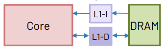
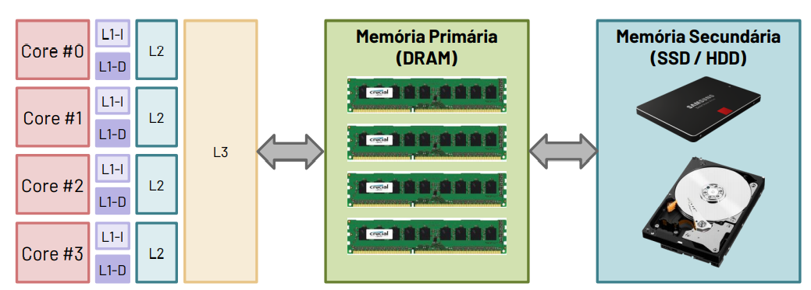
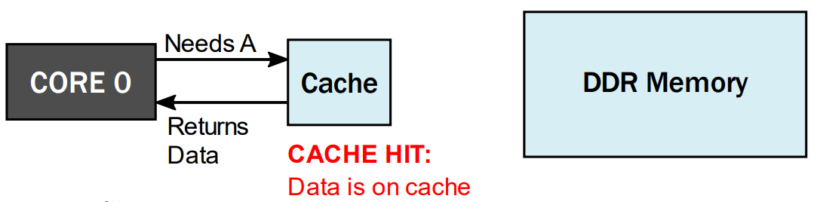
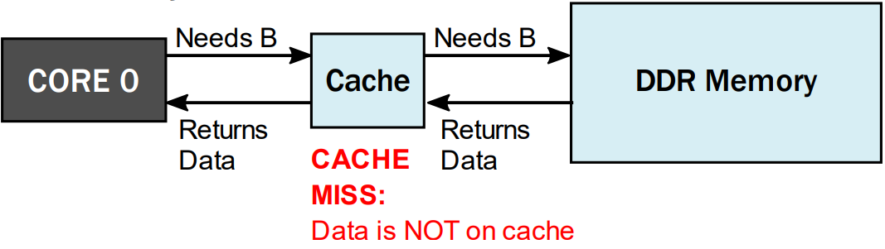
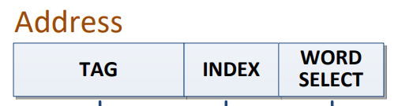
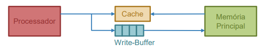

# Hierarquia de memória - Memórias Cache

**Caches**: _A safe place to store things that we need to examine_ $\to$ Representa o nível na hierarquia de memória entre o processador e a memória principal.

Como as caches L1 têm uma dimensão reduzida, geralmente os sistemas contêm uma hierarquia com 2 a 3 níveis de cache. A cache L1 é a de menor dimensão, portanto mais próxima do processador.

## Principio de funcionamento

Quando o processador precisa de um dado, faz o pedido à cache:

1. Se os dados estiverem na cache, devolve-os imediatamente:

2. Se os dados não estiverem na cache, faz o pedido à memória:

Quanto maiores e mais distantes estiverem as caches, maior a latência de acesso.

## Principio da Localidade

1. **Localidade Temporal**: Se acedermos a um endereço A, é provável que num futuro próximo necessitemos de o aceder novamente. Quando acedemos ao dado/instrução no endereço A, já que temos de pagar o custo de o ir buscar à memória RAM, mas vale armazená-lo em memória cache.

2. **Localidade Espacial**: Se acedermos a um endereço A, é provável que num futuro próximo necessitemos de aceder aos endereços adjacentes a A. Quando acedemos ao dado/instrução no endereço A, já que temos de pagar o custo de o ir buscar à memória RAM, mais vale trazer também alguns dados/instruções contíguas.

3. **Regra 90/10**: Um programa passa 90% do tempo a executar 10% das instruções.

## Organização das memórias caches

A cache mapeia os endereços da memória RAM num conjunto limitado de entradas. O que faz com que múltiplas entradas da memória RAM correspondem à mesma entrada da cache. Assim, para conseguirmos guardar na cache os dados precisamos de:

$\to$ **Bloco de dados**: Sequência de palavras de dados, correspondentes a endereços consecutivos em memória.

$\to$ **TAG**: Etiqueta para confirmação do endereço.

$\to$ **V**: Campo binário para identificar se a entrada é válida (V = 1) ou inválida (V = 0).

$\to$ **CTRL**: Sinais de controlo auxiliares.

::: tip Casos particulares

1. **Caches de mapeamento direto**: Apenas uma via, com múltiplas entradas.

2. **Cache associativa**: N vias, cada uma com múltiplas linhas. A organização de cada uma das N vias é idêntica.

3. **Cache completamente associativa**: Multiplas vias, mas cada uma contendo apenas uma linha.

:::

Quando o processador precisa de um dado, faz o pedido à cache L1. De acordo com a cache L1, esta decompõe a palavra de endereço em:

1. Escolher a entrada/linha da(s) tabela(s): **INDEX**

$$Index = log_2(Nº de linhas)$$

2. Verificar se a entrada é válida, ou seja, V=1.

3. Verificar se a entrada corresponde ao endereço pedido, confirmar o valor da **TAG**.

$$TAG = \text{Address size - offset - Index}$$

4. Se 2 e 3 forem verdadeiros $\to$ {green}(HIT). Ler a palavra pedida a partir da cache, sendo o primeiro byte associado pelo valor do offset.

$$Offset = log_2(\text{Nº de palavras})$$

::: tip Nota

Por omissão, o campo de endereço geralmente tem a mesma dimensão que a largura do registo fisico. Por exemplo: O RV32G tem endereços de 32 bits.

:::

::: details Por exemplo:

$\to$ Cache L1 para um processador com ISA RV32G

$\to$ Caracteristicas da memória cache:

- Mapeamento Direto
- Capacidade para 23 KB
- Linhas com 32B

Address = 32 bits

Como uma linha tem 32B o que corresponde a 32 endereços então:

$$\text{Offset} = log_2 32 = 5 bits$$

Index:

$$\text{Nº de linhas} = \frac{Capacidade}{\text{Nº de linhas}} = \frac{32KB}{32B} \approx 1024$$

$$log_2 1024 = 10 bits$$

Logo $TAG = 32 - 5 - 10 = 17 bits$

:::

## Estatisticas de acesso à cache

$$HIT RATE = \frac{Nº de HITS}{Nº de ACESSOS}$$

$$MISS RATE = \frac{Nº de MISSES}{Nº de ACESSOS}$$

$$MISS RATE = 1 - HIT RATE$$

::: details Por exemplo:

Desculpa, ainda não esta aqui nada :)

:::

## Caches de mapeamento associativo

- Maior associatividade $\to$ Menor número de conflitos na cache.
- Contudo, o aumento do número de vias geralmente leva a:

  1. Maior tempo de acesso.
  2. Mais recursos de hardware.
  3. Maior área de silicio e maior consumos de potência.

- Geralmente as caches têm um número de vias limitado

## Políticas de substituição

Em caso de {red}(MISS), qual das vias deve ser escolhida?

Se a linha selecionada estiver livre (V = 0) em pelo menos uma via $\to$ escolhemos essa via.

1. **First in First out**: Substituir o bloco que está na cache à mais tempo
2. **Least Recently Used**: Substituir o bloco que está à mais tempo sem ser acedido.
3. **Random replacemeant**: Escolher uma via ao acesso.
4. **Pseudo-Least Recently used**: Não substituir o bloco que foi acedido à mais tempo.

## Escrita de dados: Política de escrita e de alocação

{yellow}(Políticas de escrita:)

- **Write-back**: Escrita é realizada na cache.

Na sequência de um {red}(MISS) na cache, a linha modificada anteriormente é substituida por outra linha. Para garantir a coerência é necessário escrever o valor na memória antes de alterar a linha. Contudo é necessário que o controlador da cache tenha informação relativamente às linhas modificadas.

**SOLUÇÃO**: Introduzir um bit de controlo adicional, {orange}(Dirty bit (D)), indica quais as linhas modificadas.
Quando D = 1, indica quais as linhas que devem ser escritas em memória antes de serem substituidas.

- **Write-through**: A escrita não é realizada na cache. Não necessita do Dirty-bit, visto que aqui a memória já foi atualizada.

Para reduzir a latência das escritas, é habitual o uso de um **write - buffer**:

{yellow}(Políticas de alocação:)

- **Write alocate**: Uma escrita obriga à alocação dos dados na cache.

- **Write not - alocate**: Uma escrita nunca leva à alocação dos dados na cache.
