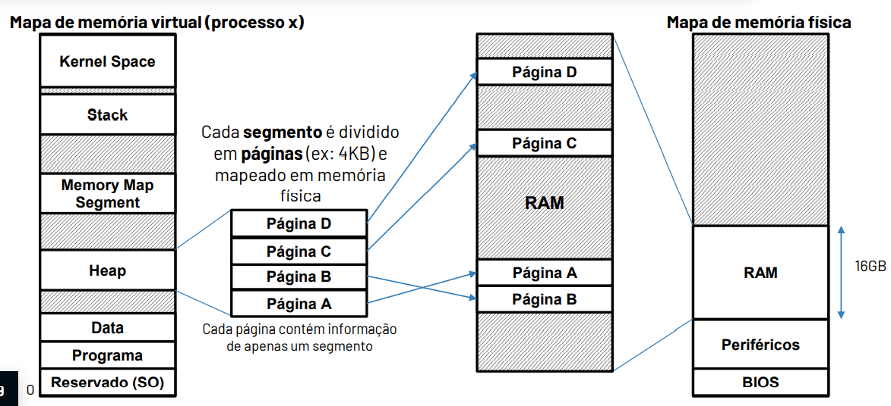
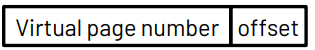

# Memória Virtual

Cada aplicação tem uma visão própria do espaço de enderençamento - **Memória Virtual**. O espaço de endereçamento virtual, visto por cada aplicação, tem de ser mapeado no espaço de endereçamento fisico. Cada segmento é dividido em páginas (em geral de 4KB) e mapeado em memória fisica. Cada página contem informação apenas de um segmento.

**Memory management Unit (MMU)**: Composta por elementos de SW e HW, realiza o mapeamento e indica o endereço fisico de cada página virtual de cada um dos processos. Este processo é transparente para a aplicação. Assim, do ponto de vista da aplicação, todas as referências são realizadas a endereços virtuais.

## Paginação do Mapa de memória

1. Divide-se cada segmento de cada um dos processos em páginas. Cada página contem apenas um segmento. Assim, é possivel existirem "buracos" (endereços livres) entre segmentos que advêm da dimensão do bloco e do segmento.

2. As páginas virtuais são depois mapeadas em memória fisica.

3. Cada processo tem uma tabela de páginas para realizar a tradução entre memória virtual e memória fisica.

Todas as referências do programa são feitas a endereços virtuais, as quais podem ser decompostas em:

$$Offset = log_2(\text{nº de enderços})$$

::: tip Nota

Como as páginas estão sempre alinhadas em memória, o seu endereço base tem sempre offset igual a 0. Assim, podemos poupar espaço na tabela de páginas omitindo, nessa tabela, os bits de offset. Desse modo, o endereço na memória fisica é obtido concatenando o valor das páginas com o offset.

:::

## Tabela de páginas hierarquia

A tabela de páginas é guardada na memória. Se a memória virtual tiver endereços de 64 de bits e cada página tiver 4KB vão existir $2^{52}$ páginas virtuais. Cada entrada na tabela de páginas tem de conter, pelo menos, o número minimo de bits em falta para endereçar a memória fisica. Se a memória fisica tiver endereços de 64 bits e sabendo que os 12 menos significativos correspondentes ao offset, restam 52 bits. Arredondando para 8B significa que a tabela de páginas ocupa $2^{52}\times 8B = 32PB$ o que é imenso.

Assim, para resolver este problema, vamos paginar a tabela de páginas. Cada página é guardada em memória como se tratasse de qualquer outra página.

{yellow}(Como saber a localização de cada página da tabela de páginas?)

$\to$ Construir uma tabela de páginas que indica a localização da tabela de páginas.

$\to$ Cada entrada da tabela de páginas indica a localização fisica de uma página em memória (excluindo bits de offset, já que são 0).

{yellow}(E se a nova tabela de páginas ainda for muito grande?)

$\to$ Repetir o processo até que a tabela de páginas de nível superior couber numa página (de modo geral = 4KB).

{yellow}(Como saber a localização de cada página da tabela de páginas de nivel superior?)

$\to$ Adicionar um registo especial no processador com a localização: {orange}(SATP: Supervisor Address Translation and Protection).

Este registo guarda a localização em memória (endereço) da base da tabela de página de nível 0. Como cada processo tem uma tabela de tradução diferente, sempre que ocorre uma mudança de contexto, o registo SATP tem de ser atualizado com o valor correto para o novo processo.

Como existem vários niveis de tradução, agora é necessário repetir o processo de indexação **n** vezes, até se descobrir o endereço de memória. Em cada passo de indexação $i={0, 1, ..., n-1}$ obtêm-se o endereço fisico da página a partir da entrada da tabela $i-1$ (onde $PT_-1$ corresponde ao SATP), e consulta-se a entrada na tabela de acordo com o seu campo PTi do endereço virtual.

::: tip Nota

O acesso a uma palavra (de dados ou instrução) requer agora **n** acessos para obter o endereço fisico, mais 1 para obter a palavra.

:::

## Estrutura de uma PTE (Page Table Entry)

1. Tem a dimensão da palavra do processador.
2. Os bits de controlo indicam os privilégios necessários para acesso à página seguinte.
3. O campo _Physical Address_ indica o endereço fisico da página de nivel seguinte (excluindo os **n** bits de offset).

::: details Exemplos:

Consideremos um processador de 64 bits, com 33 bits de endereço físico, 43 bits de endereço virtual e páginas de 8KB. A dimensão de cada PTE é de 8B. Qual o número de níveis para tradução de endereço?

{green}(Endereço Virtual:)

$$\text{Offset} = log_2(8KB) = 13 \text{bits}$$

Logo VPN vai ser $43 - 13 = 30 \text{bits}$

Como cada PTE tem 8B, o número de entradas vai ser:

$$\frac{8KB}{8B} = \frac{2^{13}}{2^3} = 2^{10} \to 10 \text{entradas}$$

Assim, o número de níveis é dado por:

$$\frac{\text{Bits do VPN}}{\text{Entradas}} = \frac{30}{10} = 3$$

E qual será o número de bits usados pela PTE para guardar o endereço da próxima página?

O endereço de nível seguinte é:

$$\text{Endereço Fisico} - \text{Offset} = 33 - 13 = 20$$

:::

## Estrutura de uma PTR (Page Table Root)

1. {yellow}(P - bit Present:)
   Quando P = 0, a página não está em RAM, o endereço no _physical address_ não é válido $\to$ {red}(Page Fault)

Quando a página existe (o SO verifica) é porque esta está em disco. Ocorre o processo de troca de páginas que se denomina **Page Swap**. Se não existe, é porque corresponde a um acesso indevido $\to$ **Segmentation Fault**

2. {yellow}(A (acessed):)
   Quando A = 0, página não é usada recentemente.

Página que pode ser movida para disco caso seja necessário realizar um _page swap_.

3. {yellow}(D (dirty):)
   Quando D = 1, significa que a página foi escrita.

Esta página não pode sair da memória RAM sem ser re-escrita (atualizada) em disco. Na prática a RAM funciona com uma politica Write-Back, Write-Allocate.

4. {yellow}(R/W Read/Write:) Permissões de escrita na memória.

5. {yellow}(EX (execute):) Permissões de execução

- EX = 1, a página contem instruções.

- EX = 0, a página contem dados.

6. {yellow}(U/S(User/Supervisor privileges):) Permissões de acesso.

## TLB: Translation Lookaside Buffer

O sistema de memória virtual aumenta a latência no acesso aos dados e instruções. Para reduzir o tempo de tradução, geralmente utiliza-se uma cache {green}(TLB) para acelerar a tradução.

A {green}(TLB) tradicionalmente corresponde a uma cache endereçada pela _virtual page number_:

- Linhas de 1 ou 2 entradas, onde cada entrada corresponde a uma PTE.

- Associatividade elevada.

### Estrutura de uma TLB com uma PTE por linha, completamente associativa

- Como a cache é totalmente associativa, não são usados quaisquer bits para índice.

- Sempre que a TLB é acedida, são verificadas todas as entradas (isto é, cada entrada corresponde a uma via diferente).

- Dado que a TLB é endereçada virtualmente, e como todos os processos têm o mesmo mapa de memória virtual, é necessário distinguir se a entrada na TLB corresponde a um processo A ou a um processo B, isto é, realizado com o campo {green}(PID - Process ID).

- Assim, existe um {green}(HIT) na TLB se:

1. V = 1
2. $TAG_{TLB} = TAB_{End. virtual}$
3. $PID_{TLB} = PID_{processo}$
