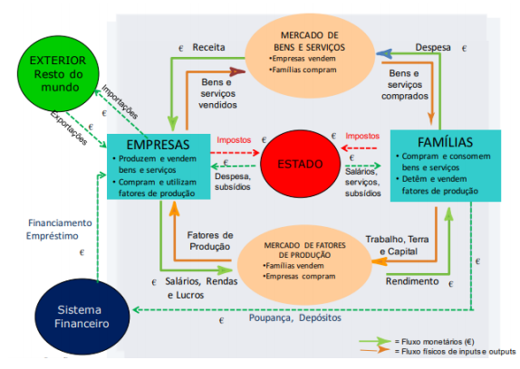
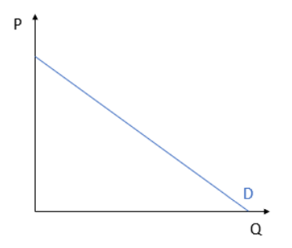
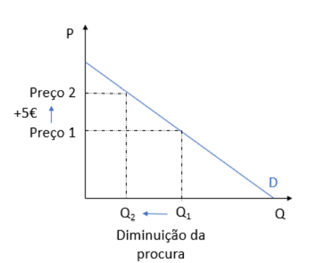
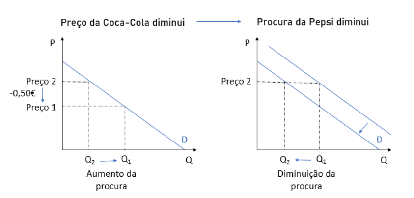

# Ambiente Económico

A economia subdivide-se em duas grandes áreas:

- **Macroeconomia**: Estuda o desempenho global da economia através de indicadores agregados.

* **Microeconomia**: Estuda o comportamento económico de entidades individuais como os mercados, as empresas e as famílias.

Como o próprio nome indica a **macroeconomia** retrata o grande cenário - o Estado, a economia Nacional e as relações económicas internacionais - recorrendo a indicadores, como o PIB, a Taxa de Desemprego, a inflação, etc. A **microeconomia** foca-se no pequeno, no detalhe, nos individuos e nas suas ações, nas empresas e no seu processamento produtivo.

## Macroeconomia

Como foi referido, a macroeconomia é o estudo, medida e observação de uma economia regional ou nacional como um todo individual. Este todo é composto por diversas pequenas partes que podem ser identificadas de acordo com o seguinte diagrama:

A macroeconomia recorre a diversos indicadores aos quais é dado o nome de variáveis macroeconómicas, são eles:

- **Produção Nacional**: Valor dos bens e serviços produzidos por todas as empresas.

* **Valor acrescentado bruto (VAB)**: Valor do rendimento gerado pelas empresas, ou seja, do que se produziu menos aquilo que se gastou.

::: tip VAB

VAB = Valor da produção - Valor dos consumos de bens e serviços

$$\sum \text{salários} + \text{juros} + \text{lucros} + \text{rendas} + \text{Impostos diretos}$$s

:::

- **Produto Interno Bruto (PIB)**: Soma do VAB de todos os agentes económicos residentes num país. Conjunto de todos os bens e serviços produzidos dentro das fronteiras de uma região ou país.

* **Produto Nacional Bruto (PNB)**: Soma do VAB de todos os agentes económicos nacionais a operar dentro ou fora do país.

- **Despesa Interna**: Gastos das unidades institucionais realizados no interior da sua fronteira económica em relação à produção interna.
  ::: tip Despesa interna
  Despesa interna = Consumo privado + Gastos do estado + Investimentos + Exportações - Importações
  :::

* **Produtividade do trabalho**: Rácio entre o PIB e o número de horas efetivamente trabalhadas. Trata-se de um indicador de competitividade económica, pois elemina-se as diferenças na distribuição de população empregada a tempo completo e parcial.

- **Taxa de Desemprego**: Percentagem de população ativa em situação de desemprego involuntário.

* **Taxa de Inflação**: Taxa de variação de preços medido pelo indice de preços do consumidor (IPC).

- **Taxa de Juro**: Taxa de renumeração de um empréstimo ou de um depósito.

* **Política Monetária**: Atuações das autoridades de política monetária sobre a oferta e a procura da moeda influenciando as taxas de juro e, consequentemente, o comportamento de investidores e consumidores e, assim, a economia real, o desemprego e a inflação.

## Taxa de Inflação

A inflação pode ser definida como o aumento generalizado dos preços. Quando há inflação (positiva) o mesmo valor em euros, compra no futuro menos bens do que no presente. Na realiadade, a inflamação não é algo completamente mau. É saúdavel para uma economia ter uma determinada taxa de inflação. No entanto, quando esta atinge niveis extremamente elevados torna-se algo problemático.

::: tip Por exemplo:

A taxa de Inflação no ano 2019 em Portugal = 0,34% Ou seja um refrigerante que custava em 2018 1,72€, no fim de 2019 valerá
$1,72 \times (1+0,0034) = 1,73$ €

Nesse mesmo ano, a taxa de inflação em Portugal, em 2019 foi de 9585,9%. O refrigerante passaria a custar $1,72 \times (1+95,859) = 166,60$ €

Ou seja, se tivesse uma moeda de 2€ guardada, ao fim de um ano, ainda seria capaz de comparar o refrigerante em Portugal (situação saudável), mas não seria capaz de comprar o refrigerante na Venezuela (situação pouco saudável).
:::

Para calcular a taxa de inflação recorre-se ao Índice de Preços no consumidor (IPC). Trata-se de um indicador que mede a evolução conjunta e simultânea dos preços de um cabaz de bens e serviços representativos da estrutura de consumo da população residente em Portugal.

::: tip Índice de Preços do Consumidor

$$\displaystyle IPC = \frac{\sum  Q_{anterior}\ P_{atual}}{\sum  Q_{anterior} P_{anterior}}$$

Podemos então definir matemáticamente o índice entre o ano $x$ e o ano $y$ como:

$$\displaystyle I^P_{x/y} = \frac{\text{Custo de um cabaz de bens no ano } x}{\text{Custo de um cabaz de bens no ano } y}$$

A taxa de inflaxão média entre estes anos será:

$$\displaystyle i_m = \sqrt[n]{I^P_{x/y}} - 1 \% $$
em que n = número de anos

:::

A **deflação** é o processo inverso à inflação, ou seja, uma diminuição do indice de preços do consumidor, associada a uma queda de preços. Apesar de, intuitivamente pensarmos que se trata de uma coisa boa (comprar mais com a mesma quantidade de dinheiro), a deflação está associada a períodos de recesão nacional.

$$\text{Taxa de variação real} = \frac {1 +\text{taxa de variação real}} {\text{1 + taxa de inflação}} -1$$

## Microeconomia

A microeconomia trata de assuntos menores que a macroeconomia. O mercado é um dos tópicos relevantes nesta área.

-**Mercado**: Conjunto dos que pretendem comprar (procura/demand) e dos que pretende vender (oferta/supply). Resultam o preço do produto e a quantidade transacionada. Existem vários fatores que influenciam a procura e a oferta.

A procura de bens pode ser definida pela curva azul do gráfico a baixo.

::: tip Procura de bens

    P = Preço do mercado
    Q = Quantidade procurada
    D = Curva de procura

:::

Apesar de estar invertido, a variável P é independente e a Q é dependente de P, ou seja, segundo esta curva, o aumento do preço implica uma diminuição da procura.

## Fatores que determinam a procura

- **Preço**: Normalmente, quando o preço aumenta, a quantidade procurada diminui, com a excepção dos bens de luxo. A variação da quantidade de procura depende da elasticidade da procura relativamente ao preço.

::: tip Por exemplo:

O preço dos cinemas subiu em 5€ no último ano:

:::

- **Bens Substituidos**: São bens que oferecem o mesmo, mas de empresas diferentes, por exemplo, Coca-Cola VS Pepsi. Neste caso, quando o preço do substituto aumenta, a procura aumenta, e vice-versa.

::: tip

:::

- **Rendimento**: O efeito do rendimento do consumidor nos bens difere consoante o tipo de bem. No caso dos **bens normais**, quando o rendiemento aumenta, a procura aumenta, um exemplo são as viagens de avião. No caso dos **bens inferiores**, a procura diminui com o aumento do rendimento, um exemplo são os produtos resultantes de pirataria ou os produtos de "marca branca".

- **Gastos/Preferências/Moda/Cultura**: Este fator depende do tipo de consumidor. Alguns preferem uma determinada marca ou uma determinada cor e outros simplesmente adquirem alguns bens por estarem na moda - estar na moda aumenta a procura de um bem.

- **Expetativa**: Este fator está relacionado com a expetativa dos preços futuros. Por exemplo, a procura aumenta por volta de outubro uma vez que, se conhece que os preços vão subir em breve, outros deixam de comprar, porque sabem que depois do Natal vêm os saldos.

Como foi possível observar, a única deslocação sobre a curva dá-se quando há uma alteração do preço. As variações dos demais fatores resultam numa alteração na ordenada na origem. Como foi referido, a variação da quantidade de procura depende da **elasticidade** da procura relativamente ao preço.

## Elasticidade

- **Elasticidade procura-preço (Ed)**: Medida de sensibilidade da quantidade procurada face à variação do preço. Esta é dada pelo quaociente entre duas variações proporcionais:

::: tip

$$E=|\frac {\Delta \% \text{Procura}} {\Delta \% \text{Preço}}|$$

ou seja

$$E= \frac {|\frac{Q_f-Q_i}{Q_i}|}{|\frac{P_f-P_i}{P_i}|}$$

:::

Desta forma compreende-se que a elasticidade de um produto é influenciada pela necessidade, possíveis substitutos, etc.

$E=1 \Rightarrow \text{Unitária}$

$E>1 \Rightarrow \text{Elástica} \rightsquigarrow$ Variações no preço induzem a uma menor procura.

$E<1 \Rightarrow \text{Rígida} \rightsquigarrow$ A procura mantém-se com flutuação do preço.
