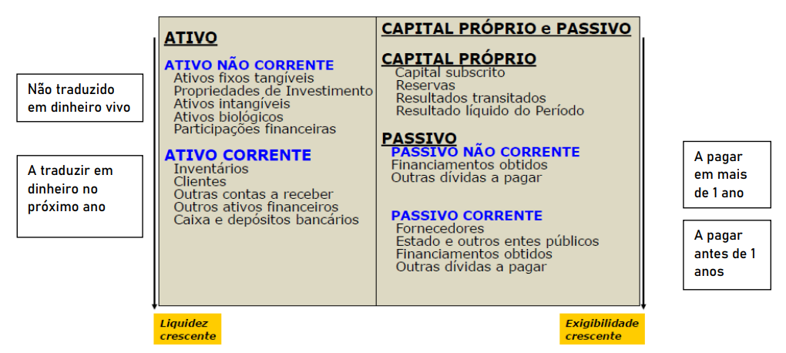
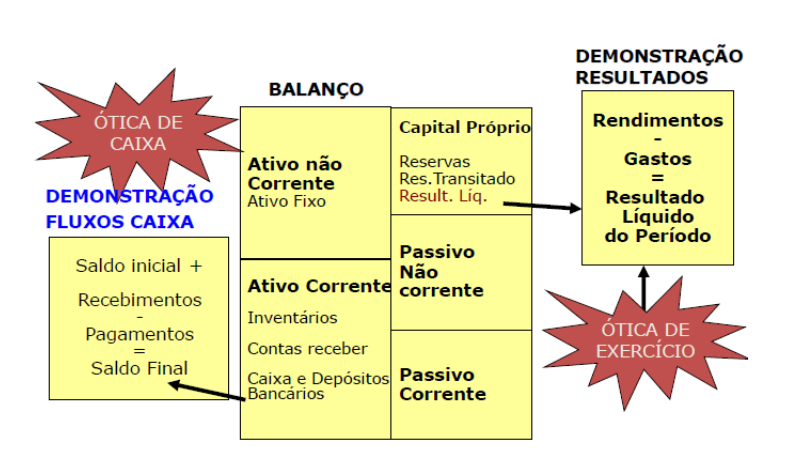
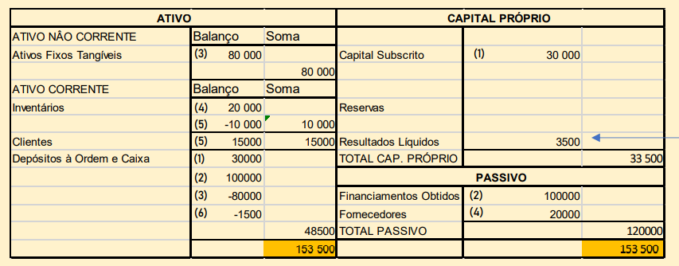
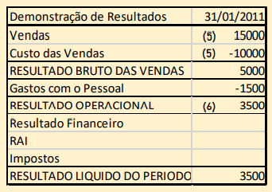
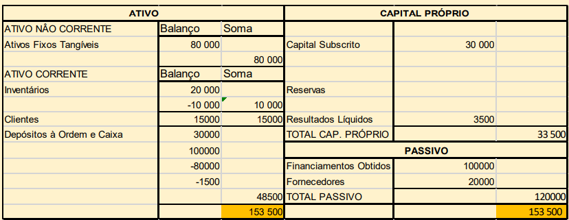

# A informação financeira

## Contabilidade

Processo formal de identificar, medir e comunicar a informação sobre o património e resultados da empresa para os decisores e outros agentes.

- **Contabilidade Geral** $\rightsquigarrow$ Financeira/externa

  - Gera informação para os elementos externos à empresa;
  - Segue as normas internacionais de contabilidade;

- **Contabilidade Analítica** $\rightsquigarrow$ Gestão/Interna

  - Gera informação específica e desagregada para apoiar a gestão;
  - Apura resultados por produtos, regiões, etc;
  - É a base para orçamentação e análise de custos.

- **Contabilidade Pessoal**

  - Tenho uma casa (150.000€)
  - Tenho um carro (10.000€)
  - Tenho depósitos bancários (2.000€)
  - Tenho uma nota no bolso (50€)
  - Devo ao banco por um empréstimo (100.000€)

::: tip Exemplo de Contabilidade Pessoal

**Património ativo**: ${casa + carro + depósitos + nota} = 162.050€$

**Património passivo**: Empréstimo

**Património Liquido**: ${Ativo - Passivo} = 62.050€$

:::

**Património**: Bens, direitos e obrigações.

**Património Ativo**: Bens e direitos $\rightsquigarrow$ Valor do que tenho mais do que me devem.

**Património Passivo**: Obrigações $\rightsquigarrow$ Valor do que devo.

**Património Liquido**: Bens e direitos.

- **Contabilidade Empresarial**
  - 5 sócios criam uma empresa de consultadoria, investindo nela 50.000€
  - A empresa compra, a pronto, portáteis no valor de 3.000€
  - A empresa presta serviço de consultadoria e recebe um pagamento de um cliente: 5.000€
  - A empresa pede financiamento ao banco no valor de 3.000€
  - A empresa paga renda de aluguer de escritório no valor de 1.000€

::: tip Exemplo de Contabilidade Empresarial

**Património ativo**: ${depósitos bancários + bens investidos} = 57.000€$

**Património passivo**: Dividas ao banco = 3.000€

**Património Liquido ou capital próprio**: ${Ativo - Passivo} = 54.000€$

:::

## O Balanço e a demonstração de resultados

O balanço é uma fotografia num dado momento da situação patrimonial da empresa. Conta com 3 grandes rúbricas, que depois podem ser distinguidos em subpartes:

- **Ativo**: Bens e direitos que a empresa possui ou tem direito a receber:

  - **Ativos fixos tangiveis**: Edifícios, equipamentos...
  - **Ativos fixos intagíveis**: Marcas, patentes...
  - **Inventários**: Produtos fabricados, em vias de fabricação ou matéria prima.
  - **Valores Monetários**: Dinheiro, depósitos e titúlos financeiros.
  - Dívidas de clientes.

- **Passivo**: Responsabilidades da empresa perante terceiros.

- **Capital próprio**: Capital realizado e lucros do período ou de períodos anteriores retidos na empresa. (não distribuido aos sócios ou acionistas).
  - **Capital Subscrito**: Dinheiro investido formalmente pelos sócios para suportar as necessidades financeiras da empresa.

::: tip

Se ativo > passivo $\rightsquigarrow$ Capital próprio > 0

Se ativo < passivo $\rightsquigarrow$ Capital próprio < 0 - Falência técnica

:::

O balanço é feito segundo o diagrama seguinte:

Uma vez que isto é um balanço a soma do dinheiro do lado esquerdo deve ser igual à soma do dinheiro do lado esquerdo deve ser igual à soma do dinheiro no lado direito. Cada alteração em elementos do **balanço** é causada por uma transação. Cada transação implica sempre no mínimo, dois registos, ou seja, qualquer variação no ativo deverá ser equilibrada por uma variação no capital próprio ou no passivo ou, então, com um balanço simétrico no próprio ativo e vice-versa.

::: tip Isto leva-nos à equação fundamental da contabilidade:

$\Delta{ativo} = \Delta{passivo} + \Delta{capital próprio}$

:::

O capital próprio traduz o valor contabilístico da empresa num determinado momento: o valor que os proprietários receberiam se cessassem a atividade, liquidando todo o ativo e passivo, e se os valores de balanço correspondessem exatamente aos valores de mercado.

::: tip Normalmente, os balanços são feitos ano a ano, por exemplo:

Dia 31/12: lucro de 1000€ (resultado liquido)

Dia 01/01: Passo para o resultado transitado:

- Se for prejuízo ficam parados;
- Se for lucro, é distribuído pelos sócios como dividendos ou vai para a reserva da empresa.

:::

Cada alteração em elementos de Balanço é causada por uma transação. Cada transação implica sempre pelo menos < registos: o sistema de transações chama-se **Dupla Entrada**.

::: tip

- **Início da atividade** $\rightsquigarrow$ Capital (subscrito): Dinheiro investido formalmente pelos sócios para suportar as necessidades financeiras da empresa.

- **Resultado líquido**: $\rightsquigarrow$ Lucro, prejuizo ou resultado nulo: Fluxo financeiro anual que corresponde à diferença entre rendimentos e gastos.

- **Património líquido a cada momento** $\rightsquigarrow$ capital próprio: Os resultados líquidos não distribuidos (ou seja, os que não são usados para pagar dívidas ou dar aos sócios) ficam no capital próprio como reservas.

:::

O balanço contabilistico e a demonstração de resultados pode ser feita segundo diferentes óticas:

- **Ótica de Caixa**: Permite ver o dinheiro que uma empresa tem num determinado momento, a liquidez;

- **Ótica de Exercício**: Permite ver se a empresa é rentável

A demonstração de resultados é o resultado líquido do período que encontramos no lado direito do Balanço, no capital próprio, é, essencialmente, um mapa que exprime para um dado período diferença entre os fluxos de rendimentos.

Exitem diversos tipos de resultados na demonstração dos mesmos:

- **Resultado Operacinal (RO)**: Dependem somente da atividade produtiva no período em análise.

::: tip RO

RO = Rendimentos Operacionais - Gastos Operacioanais

:::

- **Resultado antes do imposto (RAI)**: Resultado operacional deduzido dos gastos de financiamentos líquido.

::: tip RAI

RAI = RO - Gastos de Financiamento líquidos

:::

- **Resultado líquido do período (RL)**: Resultada da dedução do imposto sobre o resultado antes de impostos ao RAI.

::: details Por Exemplo:

Em janeiro de 2020, a Rita, O Tomás e o Rui, após terminarem o curso de Eng. Eletrótecnica, criaram e iniciaram a atividade de uma empresa de computadores. Nesse mês ocorreram os seguintes factos:

- Para iniciar a atividade, cada um dos três sócios participou com um capital de 10.000€, totalmente realizado em dinheiro.
- Contração de empréstimo bancário de médio longo prazo no montante de 100.000€.
- Aquisição de uma loja pelo montante de 80.000€. Pagamento efetuado no ato da escritura (a 01/01/2020).
- Compra de diversos equipamentos e acessórios laboratoriais para posterior comercialização. O valor da compra foi de 20.000€ e as condições de pagamento acordadas com o fornecedor foram: a 90 dias da data da fatura.
- Durante o 1.º mês a empresa faturou 15.000€, com pagamento a 60 dias. O material vendido teve um custo de aquisição de 10.000€.
- Pagou-se no final do mês ordenados e outros encargos com o pessoal no montante de 1.500€

Balança do resultados:

Demonstração de Resultados:

1. **Capital Próprio**: : Capital subscrito: $+3 \times 10.000€$ (Valor pago para formar a empresa);

   **Ativo**: Depósitos à ordem e caixa: +3x10.000€ (Quanto vale a empresa ao ser formada);

2. **Ativo**: +100.000€ (Recebido em empréstimo);

   **Passivo**: +100.000€ (Obrigação de pagar o empréstimo);

3. **Ativo**: Aquisição de um espaço próprio $\rightsquigarrow$ Ativo Fixo Tangíveis: +80.000€;

   Pagamento da loja à vista $\rightsquigarrow$ Depósito à ordem e caixa: -80000€;

4. **Ativo**: Aquisição de material $\rightsquigarrow$ Inventário +20.000€;

   **Passivo**: Obrigação de pagar aos fornecedores num prazo de 90 dias $\rightsquigarrow$ Fornecedores: +20.000

5. **Passivo**: Demonstração de Resultados: Resultados Líquidos: Vendas no valor de 15.000€, a ser pago em 60 dias, de um material que custou 10.000€ $\rightsquigarrow$ Resultado Bruto das vendas: 5000€;

   **Ativo**: Perda de inventário $\rightsquigarrow$ Inventário: -10.000€
   Direito de receber dinheiro dos clientes $\rightsquigarrow$ Clientes: +15.000

6. **Ativo**: Pagamento dos ordenados $\rightsquigarrow$ Depósitos à ordem e caixa: -1500€

   **Passivo**: Demonstração de resultados: Gastos com o pessoal: -1500€

Notar como cada balanço num lado da tabela implica um mesmo balanço do outro lado da tabela

:::

Os investimentos em ativos não correntes não são registados na demonstração de resultados como gastos quando ocorrem os pagamentos, mas o seu valor é fracionado consoante o tipo de ativo, sendo em cada ano levado a gasto somente essa fração.

- **Depreciação**: Corresponde à quebra de valor dos bens do ativo fixo tangível;

- **Amortização**: Corresponde à quebra de valor dos bens do ativo fixo intangível;

- **Depreciações e amortizações do Exercicio**: Quebra do valor das propriedades de investimento, dos ativos biológicos não consumíveis e dos ativos fixos tangíveis e intangíveis durante um período contabilístico. São consideradas um gasto na Demonstração de resultados;

- **Depreciações e Amortizações acumuladas**: Valores acumulados das depreciações e amortizações à data do Balanço (que é igual à soma das depreciações e amortizações das D.R. até essa data). Subtraídas aos valores de aquisição, produção ou reavaliação desses ativos dão origem aos valores dos ativos que aparecem registados no Balanço em cada Período.

::: tip

As depreciações e amortizações são um gasto que não dá origem a pagamentos, mas têm um impacto fiscal → mais gastos, menos resultados antes de impostos, menos impostos.

:::

## Análise de rácios financeiros

**Rácios**: indicadores de gestão que exprimem uma relação entre elementos dos documentos contabilísticos (Balanço, Demonstração de Resultados) e a partir dos quais é possível tirar ilações sobre a situação da empresa (Solidez Financeira e níveis de desempenho económico e financeiro).

### Principais orientadores de solidez financeira

- Quanto maior o capital próprio e menor o passivo (melhor ainda se o passivo for não corrente);
- Quanto maior for o somatório do capital próprio com o passivo não corrente, relativamente ao ativo corrente;
- Quanto maior a rentabilidade do capital total em relação ao juro a pagar pelo capital alheio.

## Tipos de Rácios financeiros:

1. **Rácios de Rentabilidade**: Indicam a rentabilidade do capital próprio, ativo ou vendas.

$$\text{Rentabilidade do Capital Próprio}=\frac {Resultado Líquido} {Capital Próprio}$$

$$\text{Rentabilidade das Vendas}=\frac {Resultado Operacional} {Vendas}$$

2. **Rácios de Atividade ou Funcionamento**: Indicam o grau de utilização dos recursos da empresa.

$$\text{Prazo médio de recebimentos (dias)}=\frac {Clientes} {Vendas} \times 365(dias)$$

$$\text{Prazo médio de pagamentos (em dias)}=\frac {Fornecedores} {Compras} \times 365$$

3. **Rácio de Solvabilidade/Endividamento**: Indicam a capacidade da empresa de sastifazer os compromissos financeiros de médio e longo prazo.

- **Solvabilidade**: Capacidade da empresa para responder aos seus compromissos a médio e a longo prazo:

$$\text{Solvabilidade Total ou Autonomia financeira}=\frac {Capital Próprio} {Capital Ativo}$$

- Uma boa solvabilidade total corresponde a valores acima de 1/3

$$\text{Solvabilidade Reduzida}=\frac {Capital Próprio} {Passivo}$$

- Uma boa solvabilidade reduzida corresponde a valores acima de 1/2.

4. **Rácio de Liquidez**: Indicam a capacidade de a empresa satisfazer os compromissos financeiros de curto prazo.

- **Liquidez**: Capacidade de a empresa solver os seus compromissos de curto prazo através do fundo de maneio (Ativo corrente – Passivo corrente).

Podemos avaliar o grau de liquidez da empresa, que é em função de:

- Política de crédito a clientes (+clientes $\rightsquigarrow$ + risco);
- Político de inventários (+ inventários produtos $\rightsquigarrow$ + risco);
- Política de aprovisionamento (+ inventário matérias-primas $\rightsquigarrow$ + risco).

$$\text{Liquidez geral}=\frac {Ativo corrente} {Passivo corrente} = \frac {Caixa de depósitos à ordem + clientes + Inventários} {Passivo Corrente}$$

$$\text{Liquidez Reduzida}=\frac {Ativo corrente - Inventário} {Passivo Corrente} = \frac {Caixa e depósitos à ordem + clientes} {Passivo Corrente}$$

### Limitações dos Rácios Financeiros:

- Os rácios devem ser comparados com dados de outras empresas com atividade semelhante;
- Devem ser comparados, dentro da mesma empresa, ao longo do tempo;
- Podem variar em função do país ou práticas contabilísticas;
- Atualmente, há cada vez mais consciência de que o lucro não pode ser o objetivo exclusivo das empresas.

::: details Por exemplo:

De acordo com o balanço feito à empresa da Rita, do Tomás e do Rui anteriormente:

Qual é o rácio de liquidez reduzida e o rácio de solvabilidade total? Trata-se de uma boa solvabilidade total?

$$\text{Liquidez geral \%}=\frac {Ativo corrente - Inventário} {Passivo corrente}\% =\frac {10000 + 15000 + 48500 - 10000} {20000} = 317,5\%$$

$$\text{Solvabilidade Total}=\frac {Capital Próprio} {Capital Ativo} = \frac {33500} {153500} = 0,22 < 1/3$$

Tem uma má solubilidade total uma vez que o valor é inferior a 1/3.
:::
