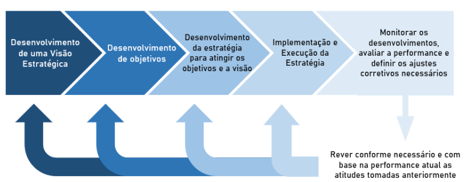
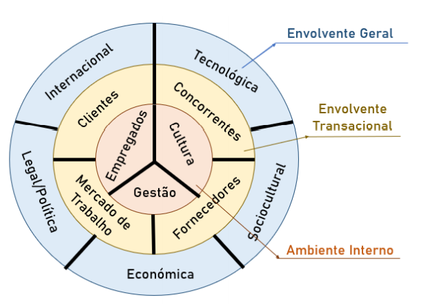
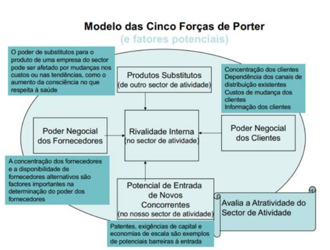
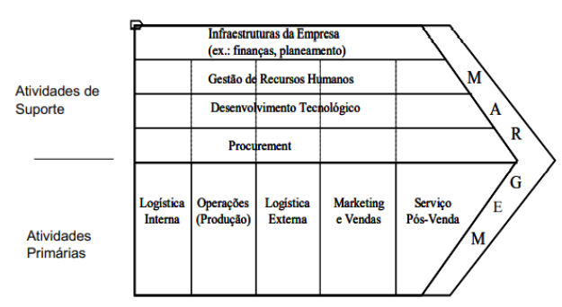
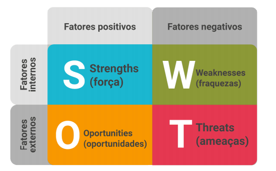
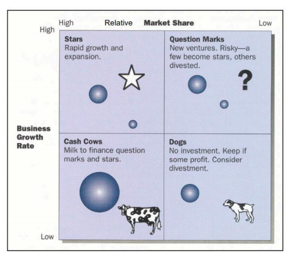
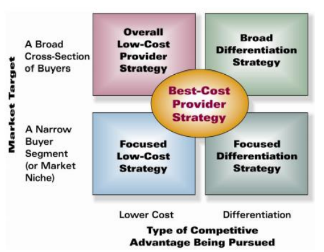

# Gestão Estratégica

Uma das responsabilidades primárias dos gestores é definir **objetivos** que a empresa deve atingir e planear como os atingir.

- **Planeamento Estratégico**:Pensar a longo prazo e ver o _big picture_, contemplando a organização e a competição e analisar a forma como estes se complementam.

- **Gestão Estratégica**:Conjunto de decisões e ações tomadas de modo a formular e executar estratégias que proporcionarão um ajuste competitivo superior entre a organização e seu ambiente, a fim de atingir os seus objetivos.

## Processo de formação e execução de estratégia

- **Visão**:Preocupa-se com o futuro e responde à pergunta _“Where are we going?”_: que mercados perseguir, quais os produtos, tecnologias e clientes em que nos vamos focar e o tipo de organização que pretendemos criar. A visão comunica as aspirações da gestão de topo aos stakeholders e ajuda a orientar os esforços dos colaboradores numa direção comum.

- **Missão**:Preocupa-se com o presente e responde à pergunta _“Who we are and what we do?”_: nos produtos e serviços oferecidos atualmente, na área geográfica onde a empresa atua, nas necessidades dos clientes que estão a ser servidas e nas capacidades que a empresa possui.

- **Objetivos**:Convertem a visão em alvos de desempenho específicos e permitem monitorar o
  desempenha da organização. São necessários objetivos para todos os níveis da organização, devem ser definidos através de um processo top-down, com
  colaboração entre níveis, de modo a garantir que os objetivos estabelecidos para níveis inferiores apoiam os objetivos dos níveis superiores.

Os objetivos bem definidos são:

1. Quantificáveis;
2. Mensuráveis;
3. Com um prazo.

Tipos de objetivos:

1. Curto/longo prazo;
2. Financeiros/Estratégicos.

## Análise para a formulação da estratégia

A análise interna e externa tem como objetivo obter informação que permita ajudar a organização a elaborar a sua estratégia.

- **Análise externa**: Identificar os principais desenvolvimentos que existem no exterior da organização e que a afetam na forma de oportunidades ou ameaças;

- **Análise interna**: Estuda o ambiente interno da organização de modo a identificar os pontos fortes e fracos que aí existem.

### Análise Externa

Foca-se em todos os elementos externos à organização e que afetam (ou podem afetar) a sua atividade direta e indiretamente, ao nível local, nacional, internacional e global.

A envolvente geral interage com todas as organizações da mesma área de atividade de forma
exógena, i.e., as empresas não conseguem influenciar este envolvente. Este é composto pelos fatores PESTL, da envolvente nacional e internacional:

- **P**oliticos;
- **E**conómicos;
- **S**ocioculturais e Demográficos;
- **T**ecnológicos;
- **L**egais.

Além de outros fatores como: Ecologia, Ambiente sustentável, etc.

A envolvente transacional trata-se das entidades que interagem diretamente com a organização e cuja influência é recíproca. É constituída essencialmente por três partes:

- **Clientes**:Individuais ou organizações que adquirem bens e/ou serviços e são a razão de existência da organização.

- **Concorrentes**:Organizações que oferecem no mercado o mesmo bem/valor ao cliente. Concorrem também no mercado de trabalho e no mercado de fornecedores. Podem ser:

  - **Intra-tipo**:Empresas que concorrem com o mesmo tipo de bem ou serviço (ex. automóveis, computadores, empresas de aviação);
  - **Inter-tipo**:Empresas que fornecem um produto substituto para o fornecimento do mesmo bem/valo (ex. comboios vs carros, livros vs e-books).

- **Fornecedores**:Podem afetar a qualidade, custos e prazos de entrega dos produtos/serviços da empresa.

O **Modelo das Cinco Forças de Porter** faz uma análise a uma indústria/setor de atividade. Segundo este modelo, a intensidade da competição numa indústria, assim como o potencial lucro dessa indústria é função de cinco forças competitivas.

Como medir a atratividade de um setor de atividade?

1. Analisar cada uma das 5 forças competitivas?

   - Maior competição interna $\to$ Menores Lucros;
   - Menores barreiras de entrada $\to$ Preços mais baixos $\to$ Menores Lucros;
   - Poucos fornecedores e clientes $\to$ Inputs mais caros $\to$ Menores Lucros.

2. Caracterizar a intensidade de cada força competitiva em:

   - Muito Fraco (1)
   - Fraco (2)
   - Moderado (3)
   - Forte (4)
   - Muito Forte (5)

3. O somatário das 5 forças (S) indica se o setor é atrativo ou não:
   - S $\approx$ 25 $\to$ Setor Não atrativo
   - S $\approx$ 5 $\to$ Setor atrativo

### Análise Interna

Trata-se do levantamento dos recursos, capacidades e competências da organização com o objetivo de identificar o que está ao alcance da organização fazer.

- **Recursos**: físicos, financeiros, humanos, organizacionais, etc.;
- **Capacidades**: - Capacidade para integrar os recursos, de forma a criar competências;
- **Competências**: Uma atividade que a organização faz bem;
- **Competências centrais (core)**: atividades que a organização faz melhor do que os seus concorrentes;

Para análise interna usamos o modelo da cadeia de valor que agrupa o conjunto de atividades desenvolvidos internamente por uma empresa de modo a evidenciar como estas criam valor para os clientes.

As atividades desenvolvidas podem ser:

- **Primárias**: Atividades principais na criação de valor para o cliente (ex. atividades envolvidas na criação física do produto, venda, distribuição e serviço após venda);

- **Suporte**: Atividades que apoiam as primárias a serem bem executadas;

### Matriz SWOT

Uma vez feita a análise externa e interna e recolhidas as principais forças (_strengths_, S), fraquezas (_weaknesses_, W), oportunidades (opportunities, O) e ameaças (_threats_, T) podemos reuni-las numa matriz SWOT que serve de base à formulação de estratégias:

Uma vez feita esta matriz, uma empresa pode, por exemplo, perseguir as oportunidades que melhor se ajustem aos pontos fortes da empresa, ou usar os seus pontos fortes para tentar minimizar uma ameaça, enfim, várias decisões possíveis.

## Formulação de Estratégia

A formulação da estratégia pode passar essencialmente em 4 níveis diferentes:

- Corporativo;
- Negócio;
- Funcional;
- Operacional.

### Estratégia ao nível corporativo

Principais estratégias possíveis:

1. Diversificação para outras áreas de atividade;
2. Integração vertical;
3. Internacionalização.

A matriz **BCG** pode ajudar a decidir uma estratégia possível. Esta matriz ajuda a perceber em que ponto se encontra uma empresa e a estratégia a tomar.

A integração vertical visa a criação de valor através da produção própria dos “inputs” necessários (_Backward vertical integration_) e/ou da distribuição própria dos produtos produzidos pela empresa (_forward vertical integration_):

Fornecedor $\xleftarrow{Backward}$ Distribuidor $\xrightarrow{Forward}$ Retalhista

Isto pode ter vantagens ou desvantagens:

- **Vantagens**: Reduz custos das matérias primas e do canal de distribuição, diminui a dependência de fornecedores ou de distribuidores (promove a concorrência entre eles), e aumenta a visibilidade da empresa junto ao cliente final;

- **Desvantagens**: Maior necessidade de recursos, a existência de fornecedores físicos, o que pode significar menor flexibilidade para lidar com novas necessidades dos clientes, e uma maior necessidade de coordenação resultante da integração de uma
  nova cadeia de valor.

A internacionalização pode ser uma mais-valia no sentido de:

- Obter acesso a novos clientes;
- Alcançar menores custos, capturando mais facilmente economias de escala;
- Explorar as competências centrais desenvolvidas no mercado doméstico em mercados estrangeiros;
- Obter acesso a recursos;
- Capacidades localizadas em mercados estrangeiros e espalhar o risco do negócio por um conjunto mais amplo de mercados.

### Estratégia ao nível do negócio

Uma empresa consegue uma vantagem competitiva quando um número considerável de clientes prefere os seus produtos/serviços aos dos oferecidos pelos concorrentes. Existem cinco estratégias genéricas que visam a obtenção de vantagens competitivas sustentáveis.

As empresas devem selecionar a sua estratégia tendo em conta:

1. Se deseja entrar em muitos ou poucos segmentos de mercado;
2. Se a sua vantagem competitiva é baseada em custos baixos ou diferenciação.

As estratégias possíveis são, então:

1. **Liderança de baixo custo**: : O objetivo é agressivamente conseguir custos mais baixos do que a concorrência (custos totais; não apenas custos de produção), de preferência utilizando abordagens que sejam difíceis de igualar ou copiar pelos rivais;
2. **Diferenciação**: Envolve distinguir os produtos/ serviços da firma dos da concorrência de um modo a captar a preferência dos clientes para a oferta da empresa;
3. **Nicho ou foco** _“Focused Differentiation”_: Servir só um segmento de mercado e ser a organização mais diferenciada (única) desse segmento;
4. **Nicho ou foco** _“Focused Low-Cost”_: Servir só um segmento de mercado e ser a organização de mais baixo-custo desse segmento;
5. **“Best-Cost Provider”**: Tentar seguir simultaneamente uma estratégia de Liderança de
   baixo-custo e de Diferenciação. Os clientes-alvo serão aqueles que atribuem valor à diferenciação mas têm em atenção se pagam um preço baixo – _"value for money"_.

