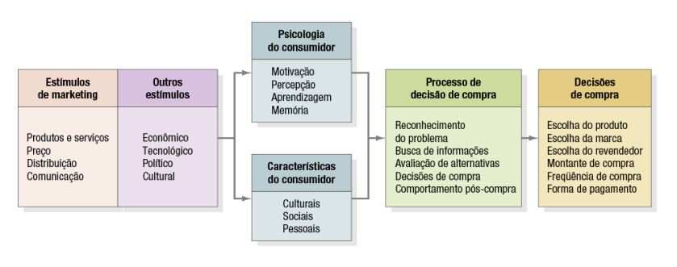
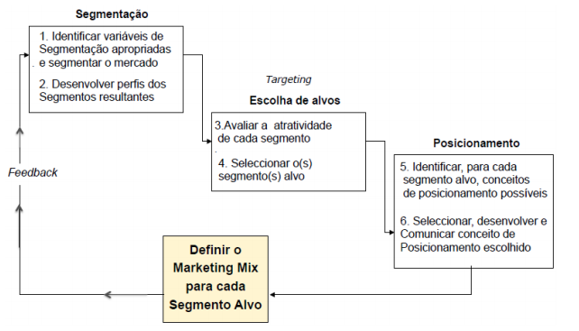
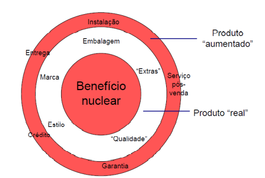
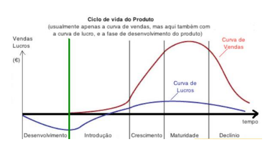
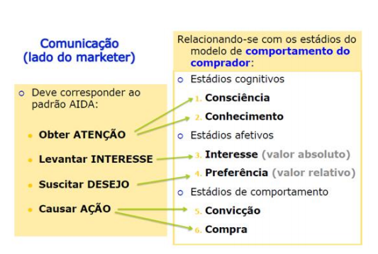
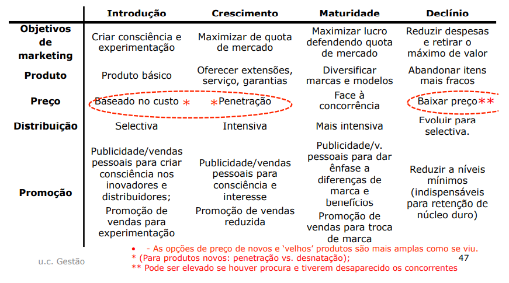

# Marketing

**Marketing**: Arte de explorar, criar e entregar valor para satisfazer as necessidades do mercado. São usados produtos ou serviços que possam interessar aos consumidores.

Parte de 4 etapas de vontade dos clientes:

Necessidades $\to$ Desejos $\to$ Produtos $\to$ Mercados

::: details Por exemplo:

Durante um passeio em Lisboa:

"Mãe, tenho fome, que um Big Mac!"

"Não, André, está muita gente na fila, vamos a outro lado."

**Necessidade**: Ter fome, precisar de comida.

**Desejo**: Quer comida, mas em particular, um hamburguer.

**Produtos**: Quer comida, que um hamburguer, mas não quer um qualquer, tem de ser um Big Mac.

**Mercados**: O conjunto de pessoas que querem comprar este produto condicionam a vontade da mãe.

:::

## Filosofias das organizações na abordagem ao mercado

- **Conceito de Produção**: Os consumidores privilegiam produtos largamente disponiveis. $\to$ Eficiência, custos baratos, produção em massa.

- **Conceito de Produto**: Os consumidores preferem produtos com melhor qualidade desempenho e inovação. $\to$ Excelência e qualidade.

- **Conceito de Venda**: Os consumidores exibem algum interesse em consumir o que lhes é proposto $\to$ Proatividade, Força de Vendas, Promoção.

- **Conceito de Marketing**: O centro da ação devem ser os consumidores e a satisfação da sua necessidade e não o produto. $\to$ Encontrar o produto adptado a essas necessidades.

- **Conceito de Marketing Social**: Marketing em que existe ainda a preocupação com o bem estar dos consumidores e da sociedade em geral.

## Comportamento do consumidor

O processo de decisão do comprador (consumidores individuais) passa essencialmente por 5 etapas:

### Características e psicologia do consumidor

- **Culturais**: Cultura, subcultura e classe social;

- **Sociais**: Grupos de referência, família, papéis e _status_;

- **Pessoais**: Idade, ocupação, estilo de vida;

- **Psicológicas**: Motivação, perceção, aprendizagem, crenças e atitudes.

### Processo de decisão do comprador

1. **Reconhecimento do problema ou necessidade**: Motivação desencadeada por Estímulos internos (por exemplo, fome) e/ou Estímulos externos (por
   exemplo, o anúncio de um novo hamburger Atlanta);

2. **Pesquisa de informação**: Fontes: Pessoais, Comerciais, Públicas, Experienciais;

3. **Avaliação de alternativas**: Atributos e seu grau de importância: Procedimento de Avaliação (por exemplo, comparando os produtos com
   base nos atributos, e na importância que damos a cada um daqueles)

4. **Decisão de compra**: Compra Intenção vs. Compra: Atitudes de Terceiros, Situações Inesperadas (por exemplo sugestões na loja);

5. **Avaliação pós-compra**: Expectativas vs. Perceção de Desempenho: Satisfação/Insatisfação;

## Mercados Organizacionais

**Compra organizacional**: Processo pelo qual organizações formais estabelecem a necessidade da compra de produtos e serviços e identificam, avaliam e escolhem entre marcas e fornecedores alternativos.

Os mercados organizacionais podem ser:

- Industriais
- De revenda
- Governamentais

Estes normalmente encontram-se em número relativamente reduzido de clientes de grande dimensão e frequentemente concentrados geograficamente. A sua procura pode ser derivada:

- Dependente da procura do produto final, ou flutuante.
- Variação da procura do produto final causa maior volatilidade da procura dos elementos a montante.
- O processo de decisão é normalmente complexo, profissional e formalizado.

## Segmentação, Targeting e Posicionamento (STP)

- **Marketing indiferenciado (ou de massas)**: Abordagem mais antiga. Desenvolveu-se com a produção em massa, promovendo a venda do mesmo produto a todos os clientes.

- **Marketing diferenciado (ou segmentado)**: Permite a diferenciação de um ou vários elementos do _Marketing Mix_ para cada um dos diferentes clientes selecionados. Abordagem mais precisa sabendo-se antecipadamente a quem queremos que a oferta interesse.

A estratégia de Marketing passa por 3 grandes etapas:

### Segmentação

A segmentação constitui o agrupamento de consumidores com maiores semelhanças entre si em grupos, ou, segmentos, com substanciais diferenças em relação aos membros de outros segmentos. Por esta razão, o segmento selecionado como alvo deverá ser tratado de forma diferente comparativamente a outro segmento-alvo.

Para ser eficaz, uma boa segmentação exige que cada segmento tenha certas características substanciais - diferenças grandes que justificam a formação de um novo segmento - e diferenciais – pequenas características relevantes mas que não justificam tanto a formação de um novo segmento.

A segmentação pode ser feita segundo:

1. Características dos consumidores:

   - Geográficas (País, Clima, etc);
   - Demográficas (Idade, Sexo, Classe, etc);
   - Psicográficas (Personalidade, Valores, etc);

2. Comportamento dos consumidores:
   - Por ocasiões (ex: viagens de férias/negócio);
   - Por benefícios pretendidos (qualidade, serviço, etc);
   - Por lealdade para com as marcas;
   - Por taxa de utilização do tipo de produto;
   - Por estado de prontidão.

### Targeting (Escolha de alvos)

O targeting compreende a escolha dos segmentos de mercado que a organização servirá. Esta escolha baseia-se numa avaliação da atratividade dos segmentos. Esta escolha pode ser de 3 tipos:

1. **Marketing concentrado**: Seleção de um só segmento;
2. **Especialização seletiva**: Cobertura de vários segmentos atraentes, relacionados ou não;
3. Cobertura total dos segmentos do mercado.

### Posicionamento

O posicionamento constitui a forma como um produto é definido pelos consumidores em atributos importantes, ou seja, a posição que este ocupa na mente do consumidor e como se diferencia em relação aos seus concorrentes.

As formas de diferenciação mais comuns baseiam-se no produto, no serviço, no pessoal e na imagem do produto.

## Marketing Mix

O Marketing Mix é um conjunto de variáveis controláveis que influenciam a forma como os consumidores respondem ao mercado e consiste naquilo que a empresa pode fazer no sentido de influenciar a procura pelo seu produto, visando alcançar o nível desejado de vendas junto do seu mercado-alvo.

Este é feito segundo os chamados 4 Ps, quatro variáveis básicas que congregam todas as variáveis do Marketing Mix:

- **P**roduto
- **P**reço
- Distribuição (**P**lace)
  . Comunicação (**P**romotion)

### Produto

Produto constitui tudo o que pode ser oferecido a um mercado para aquisição, atenção, uso ou consumo e que possa satisfazer uma necessidade ou desejo.

Na mente do consumidor o produto possui imensos níveis de interesse:

O benefício nuclear corresponde à satisfação da necessidade original do consumidor. A partir daí o produto vai ganhando espaço no desejo do consumidor consoante aquilo que o produto oferece, para além da satisfação da necessidade: uma embalagem diferenciadas, uma qualidade maior, uma marca de renome. A organização ainda pode “aumentar” as qualidades oferecidas pelo produto através de garantias, por exemplo.

Os produtos podem ser bens físicos (ex. PlayStation 4), um serviço (ex. Aulas), eventos e experiências (ex. NOSalive), lugares (ex. Arquipélago da Madeira), pessoas (ex. Cristiano Ronaldo), informações (ex. Lisboa 2020) ou ideias (ex. Política).

Quanto à durabilidade ou tangibilidade os produtos podem ser classificados em:

- Não duradores;
- Duradouros;
- Serviços.

::: tip Por exemplo:

Uma aula é um serviço que não é duradouro, pois só está disponível durante uma hora e meia, no dia específico, uma vez por ano, e não é algo tangível.

:::

Os bens de consumo podem ser classificados, consoante aos hábitos de compra dos consumidores em:

- Bens de conveniência;
- Bens de comparação;
- Bens de especialidade;
- Bens não procurados.

Os produtos industriais podem ser classificados em:

- **Bens de capital**: Não integram o produto final (Ex: instalações e equipamentos);
- **Partes e materiais**: Que integram o produto final (ex: Matérias primas, componentes, etc);
- **Fornecimentos e serviços**: Bens que facilitam a produção.

Um serviço é qualquer ato ou desempenho que uma parte pode oferecer a outra, que é essencialmente intangível e não resulta na posse de algo. A sua produção pode ou não estar ligada a um produto físico.

Embora seja difícil generalizar, devido à sua grande heterogeneidade, os serviços partilha (mas com diferentes graus) características que condicionam/determinam o Marketing Mix apropriado:

- Intangibilidade;
- Inseparabilidade (Simultaneidade);
- Variabilidade (Heterogeneidade);
- Perecibilidade.

::: tip Por exemplo:

As aulas de Japonês da Joana (Intangibilidade) são dadas todas as quintas, às 17h30 (Inseparabilidade), pela professora Himiko ou pela sua professora substituta Hinata (Variabilidade). Se a Joana faltar à aula, ela perde-a completamente (Inseparabilidade) pois esta é dada independentemente da sua presença (Perecibilidade).

:::

A história de venda de um produto apresenta diferentes estágios, com potenciais de lucro, oportunidades e prolemas de estratégia, e políticas de Marketing Mix.

### Preço

O preço é a única componente do Marketing Mix que produz receitas, os demais constituem despesas. O preço é somente um entre muitos outros fatores que afetam a escolha do produto a comprar. Uma competição com base no preço é uma estratégia indesejável. A decisão de um preço é fruto de vários fatores externos e internos:

- Sensibilidade ao preço $\to$ Muito dependente do segmento e da situação económica;
- Situação competitiva $\to$ Apesar de ser indesejável, o ajuste do preço é dependente da competitiva;
- Perceção do comprador da relação preço/valor $\to$ Dependente do restante Marketing Mix, da qualidade do produto e do efeito psicológico que este tem no consumidor.

O preço escolhido tem em conta os fatores acima. Os custos levados com a produção e os encargos do Marketing Mix definem um preço mínimo do produto, enquanto isso, o valor percetual do produto para o cliente define o preço máximo. O preço escolhido deverá ser entre este máximo e mínimo tendo em conta a concorrência, o segmentos do mercado e o posicionamento pretendido.

Por outro lado, a definição do preço de um novo produto pode passar por duas estratégias mais extremas: a desnatação e a penetração.

A estratégia de desnatação consiste no estabelecimento, para um novo produto inovador, de um preço elevado (particularmente tendo em conta os custos de produção) durante o primeiro período do respetivo ciclo de vida.

A penetração consiste, basicamente, na fixação de um preço reduzido, inicial no sentido de tornar possível uma rápida e profunda aceitação do produto em causa no mercado correspondente.

Para a redefinição do preço de um produto já existente devemos considerar a perecibilidade, o grau de diferenciação e estado do ciclo de vida que o produto se encontra.

A adaptação momentânea do preço de um produto pode ser consoante quatro fatores:

- Preços promocionais (ex. acontecimentos especiais);
- Preços discriminatórios (ex. Por segmento de clientes ou por data/hora);
- Preços de gama (ex. Por linhas de produtos);
- Preço base e descontos (ex. Descontos financeiros, sazonais, etc.).

### Distribuição

A distribuição debruça-se sobre levar o produto/serviço a pessoa certa, no momento certo tendo em contra o lucro e a eficácia.

Os canais de distribuição correspondem a qualquer intermediário entre a empresa e o destinatário final do bem/serviço, este intermediário podem ser indivíduos e firmas, donas ou não do produto, que assistem na sua transferência ao comprador final.

A utilização de intermediários não detentores do produto, i.e, empresas terceirizadas como, por exemplo, a UPS, FEDEX, etc., reduz o controlo sobre passos importantes do processo de marketing. Em contrapartida, torna mais eficiente a disponibilização dos produtos aos mercados alvo devido à sua especialização, o seu contacto frequente, a sua economia de escala e a suaexperiência neste tipo de serviço.

Os circuitos de distribuição podem ter vários níveis, consoante as “mãos” pelas quais o produto passa do produtor ao consumidor.

Em cada nível do canal, os intermediários podem ser vários tipos:

- Distribuição exclusiva (apenas uma ou muito poucas lojas de uma pequena cadeia –restringindo o número por área geográfica. Por exemplo venda de produtos Gucci através das lojas daquela marca);
- Distribuição seletiva (apenas alguns intermediários, para manter controlo – por exemplo sobre o tipo de serviço. Por exemplo certos modelos de televisores podem ser vendidos apenas através de certas cadeias de lojas);
- Distribuição intensiva (em muitos pontos de distribuição; frequentemente associada a bens de conveniência, tais como refrigerantes, massas, arroz, jornais).

### Comunicação

A comunicação/promoção é o conjunto de atividades desenvolvidas pela empresa para comunicar com os eu clientes – atuais e potenciais.

Por vezes associa-se o termo promoção e Marketing como sendo sinónimos, mas, pelo que já vimos, o Marketing é bem mais amplo, sendo a promoção uma das partes.A comunicação/promoção tem os seguintes componentes relevantes:

- **Publicidade**: Forma paga de apresentação e de comunicação não pessoal de organizações, ideias, bens ou serviços, efetuada por um patrocinador identificado, para uma audiência alvo, através de um meio de comunicação de massas;
- **Promoção de vendas**: Incentivos de curto prazo e temporários destinados a encorajar experimentação ou compra (ou recompra) de um bem ou serviço;
- **Força de vendas**: Interação pessoal com compradores (correntes e potenciais);
- **Marketing Direto**: Comunicação ou solicitação direta da atuação de clientes atuais e potenciais específicos utilizando o correio, telefone, e-mail ou outros meios não pessoais;
- **Online, social media e mobile marketing**: Atividades on-line e programas desenhados para envolver clientes atuais ou potenciais: websites, comunidades on-line, blogs e redes sociais como Facebook e Twitter, mensagens de texto e apps para smartphones e tablets;
- **Relações Públicas**: Programas destinados a promover e/ou proteger a imagem da organização ou dos seus produtos;
- **Eventos e experiências**: Eventos e experiências são atividades e programas patrocinados e concebidos para criar interações diárias ou especiais com marcas.

A resposta comportamental pretendida pela ação de comunicação é condicionada pelo estado do comprador:

Podemos definir duas estratégias de marketing possíveis: Push e Pull. Marketing push dá-se,por exemplo, quando o produto não é conhecido do grande público e tem que se promover junto dos distribuidores e dos retalhistas até chegar ao consumidor final; marketing pull é promover diretamente junto do consumidor final que vai pedir os produtos às lojas e estas aos distribuidores.

Resumindo o que foi abordado neste capítulo, embora esteja longe de universalmente aplicável, o quadro seguinte ajuda a entender a ênfase do Marketing em cada fase do ciclo de vida do produto

