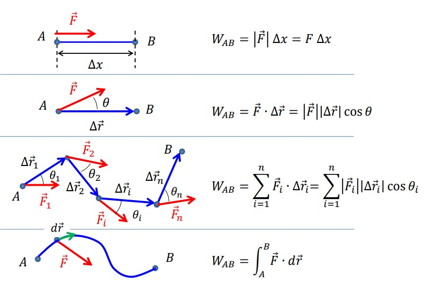
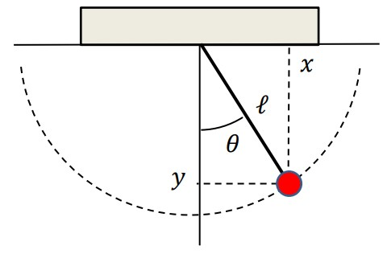

# Simetrias e Leis de Conservação

## Princípio da Ação Mínima (Princípio de Hamilton)

O princípio de Hamilton diz nos que um sistema físico irá seguir, de entre todas as trajetórias possíveis, aquela que minimiza o integral S designado por Ação.

::: tip Lagrangiano

A função $\mathscr{L}$ designada função de Lagrange depende das coordenadas $r=(r_1,r_2,...,r_n)$ e respetivas derivadas $\dot r=(\dot r_1, \dot r_2,..., \dot r_n)$.

$\displaystyle \delta S = \delta (\int^{t_2}_{t_1} \mathscr{L}(r, \dot r, t)dt) = 0$

Em mecânica clássica, a função $\mathscr{L}$ é dada por:

$\displaystyle \mathscr{L}=T-U$

em que T e U representam, respetivamente, as energias cinética e potencial do sistema.

:::

::: tip Demonstração das Leis de Newton

Usando o princípio da ação mínima e equações de Euler-Lagrange, é possível demonstrar todas as Leis de Newton

:::

## Voltando a Newton

::: tip

- O trabalho de uma força é igual à variação de energia cinética

$W_{AB}=\Delta E_c$

- O trabalho de uma força conservativa é igual à variação da energia portencial, pelo que não depende do caminho de aplicação da força.

:::

## Graus de liberdade e Coordenadas Generalizadas

Graus de Liberdade de um sistema correponde ao número mínimo de variáveis independentes necessárias para a descrição do sistema.

As equações de Euler-Lagrange podem ser escritas em função das variáveis generalizadas, $q_i$, correspondentes aos graus de liberdade do sistema.

$$
\frac{\partial L}{\partial q_i} - \frac{d}{dt}(\frac{\partial L}{\partial q_i}) = 0
$$

Por exemplo, no caso do pêndulo gravítico plano, as variáveis $x$ e $y$ não são independentes uma vez que a trajetória (circular) do pêndulo permite conhecer $x$ para um dado $y$ e vice-versa. Neste caso, utiliza-se apenas uma variável $(\theta)$ que define a posição do pêndulo. Diz-se então que o sistema tem apenas **um** grau de liberdade.

A partir desta imagem, de um pêndulo gravítico, podemos deduzir que:

$$\begin{cases} x = l \sin \theta \\ y = l \cos \theta \end{cases} \implies \begin{cases} \dot x = l \ \dot \theta \cos \theta \\ \dot y = -l \ \dot \theta \sin \theta \end{cases}$$

## Forças de atrito

Como as forças de atrito têm sempre o sentido contrário ao da velocidade, o trabalho das forças de atrito é sempre negativo.

$$
\overrightarrow{F_\alpha} = -K_\alpha |\overrightarrow{v}^\alpha| \overrightarrow{e_v}
$$

- **Atrito sólido - sólido**: Quando $\alpha = 0$

$$
\overrightarrow{F_0} = - K_0 \overrightarrow{e_v}, K_0 = \mu |\overrightarrow{P}|
$$

- **Atrito sólido - liquido (fluidos)**: Quando $\alpha = 1$

$$
\overrightarrow{F_\alpha} = - K_1 |\overrightarrow{v}| \overrightarrow{e_v}
$$

- **Atrito sólido - fluido (alta velocidade)**: Quando $\alpha = 2$

$$
\overrightarrow{F_\alpha} = - K_2 |\overrightarrow{v}|^2 \overrightarrow{e_v}
$$

[Revisões 12 ano - Fluidos](https://drive.google.com/file/d/1Lraa6zYGGR1W2YVYLTMXLO-NQXi6NPnM/view?usp=sharing)

## Energia Mecânica e Potência

A energia mecânica é dada pela soma da energia potencial com a energia cinética:
$E = T + U$

Na presença de forças exteriores $\frac {d}{dt} (T + U) = \frac {dE}{dt} = 0$ $\implies$ Lei da conservação da energia mecânica.

Assim, na presença de forças exteriores, a energia mecânica do sistema não se conserva:

$$
\frac {dE}{dt} = \sum F_i^{ext} r_i
$$

::: tip Se:

- A resultante das forças exteriores tem o mesmo sentido que o movimento, as forças exteriores fornecem energia ao sistema:
  $\frac {dE}{dt} > 0$

- A resultante das forças exteriores tem o sentido oposto ao do movimento, o sistema perda energia para o exterior (ex: Forças de atrito):
  $\frac {dE}{dt} < 0$

- A resultante das forças é perpendicular ao movimento, força normal no caso do pendulo.
  $\frac {dE}{dt} = 0$

:::
