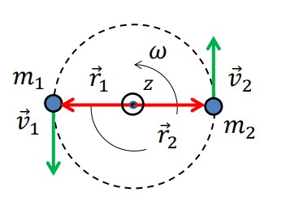

# Momento Angular

Consideremos o exemplo de duas partículas em rotação em torno do centro de massa.

Neste caso, para além das massas $m_1$ e $m_2$ e velocidades $\overrightarrow{v}_1$ e $\overrightarrow{v}_2$

$$\overrightarrow{L}=\sum \overrightarrow{r}_i \times \overrightarrow{p}_i = \sum \overrightarrow{r}_i \times (m_i\overrightarrow{v}_i)$$

Como $v=\omega r$,

$$\overrightarrow{L}=(m_1r_1^2+m_2r_2^2)\omega \overrightarrow{e}_z$$

Sendo I, o momento de inércia temos:  
$I=m_1r_1^2 + m_2r_2^2 \implies \overrightarrow{L}=I\overrightarrow{\omega}$

## Conservação do momento linear

Na ausência de momento forças (torque) exterior.

$$\frac{d\overrightarrow{L}}{dt}=0$$

**Isotropia do espaço**: Invariância do sistema para rotação.
A rotação do sistema é caracterizada por um vetor $\delta\overrightarrow{\varphi}$, todo o sistema roda segundo este angulo.
**Invariância do Lagrangiano do sistema**: $\delta L=0$.

## Em Resumo

### Momento Angular de uma particula em rotação

$$\overrightarrow{L} = \overrightarrow{r} \times (m\overrightarrow{v}) = m r^2 v \overrightarrow{w}$$

### Momento Angular de 2 particulas em rotação em torno do centro de massa

$$\overrightarrow{L} = I \overrightarrow{W}$$

$$I = m_1 r_1^2 + m_2 r_2^2$$

### Momento Angular de um corpo em rotação em torno de um eixo principal de inércia

$$\overrightarrow{L} = I \overrightarrow{w}$$

$$ I = \varSigma {m_i R_i^2}$$

### Momento de Inércia para um corpo contínuo linear:

Por exemplo: Arame ou Anel (Coisas com uma massa certa por unidade de comprimento)

$$I = \int R^2 dm = \int R^2 \mu dr$$

::: details Por exemplo:

Rotação de um anel em torno de um eixo perpendicular que passe pelo centro do mesmo. O anel tem 1 eixo principal de inércia vertical, mas também tem eixos horizontais de inércia infinitos.

$$I = \int R^2 dm = \int R^2 \mu dl = \mu R^2 \int _{0}^{2\pi} d\theta = \mu R^2 (2 \pi R) = MR^2$$

:::

### Momento de inércia no caso de um corpo contínuo de espessura desprezável

Por exemplo: folha de papel.

$$I = \iint R^2 dm = \iint R^2 \sigma ds$$

em que $\sigma$ é a densidade superficial.

::: details Por exemplo:

Rotação de um cilindro oco homogéneo de espessura desprezável em torno do eixo de simetria cilindrica.

$$
I = \iint R^2 dm =
\iint R^2 \sigma dS =
$$

$$
R^2\int _{0}^{h}\int _{0}^{2\pi} \sigma R d\theta dz =
\sigma R^2 \int _{0}^{h} dz \int _{0}^{2\pi} R d\theta =
\sigma R^2(2 \pi Rh)
$$

:::

### Momento de inércia no caso de um corpo contínuo em 3D

$$\iiint R^2 dm = \iiint R^2 \rho dV$$

em que $\rho$ é a densidade

::: details Por exemplo:

Rotação de um cilindro maciço homogéneo em torno de eixo de simetria cilindrica. (Cilindro totalmente fechado)

$$I = \iiint r^2 \rho dV =$$
$$\rho \int _{0}^{h}\int _{0}^{R}\int _{0}^{2 \pi} (rd \theta dr dz) =$$
$$\rho \int _{0}^{h} dz \int _{0}^{R} r^3 dr \int _{0}^{2 \pi} d \theta =$$
$$\rho h \frac{R^4}{4} 2\pi = \frac {R^2}{2}(\pi R^2 h \rho)$$

$$I = \frac {MR^2}{2}$$

:::

::: details Outros exemplos

- Rotação de uma barra homogéneo de secção desprezável em torno do eixo perpendicular que passe pelo centro de massa.

$$
\mu \int _{\frac{-l}{2}}^{\frac{l}{2}} x^2 dx =
\mu [\frac {x^3}{3}]\_{\frac{-l}{2}}^{\frac{l}{2}} =
\mu \frac{1}{3} \frac{l^3}{4} =
\mu l \frac {l^2}{12}
$$

- Rotação de uma esfera maciça homogénea em torno de um eixo que passe pelo centro.

$$d I = \frac{1}{2}(dmz)a^2$$
$$dmz = \rho \pi a^2 dz$$
$$dI = \frac {1}{2} \rho \pi a^4 dz$$
$$I = 2 \int _{0}^{R} dI = \int _{0}^{R} \frac {1}{2} \rho \pi a^4 dz =$$
$$\int _{0}^{R} \frac {1}{2} \rho \pi (R^2 - z^2)^2 dz =$$
$$\rho \pi \frac{8}{15} R^5 =$$
$$\rho \pi \frac{2}{5} \frac{4}{3} R^3 R^2$$

$$I = \frac{2}{5} M R^2$$

:::

## Tensor de Inércia

Quando o eixo não é o eixo principal de inércia (o eixo de rotação não é um eixo principal de inércia). Este eixo é definido pela direção da velocidade angular $\overrightarrow{w} = (w_x,w_y.w_z)$

$$\overrightarrow{L} = \sum \overrightarrow{r_i} \times \overrightarrow{p_i}$$

$$ = \sum \overrightarrow{r_i} \times (m_i \overrightarrow{v_i})$$

$$ = \sum m_i \overrightarrow{r_i} \times (\overrightarrow{w} \times r_i)$$

No caso geral do corpo rigido, composto por massas elementares _m_i_ com coordenadas $\overrightarrow{w} = (w_x, w_y, w_z)$

$$
\overrightarrow{L} = \sum \overrightarrow{r} \times \overrightarrow{p_i} = \sum \overrightarrow{r} \times (m_i \overrightarrow{v_i}) =
\sum m_i \overrightarrow{r_i} \times (\overrightarrow{w} \times \overrightarrow{r_i})
$$

$$
\overrightarrow{L} = \sum m_i \overrightarrow{r_i} \times \begin{vmatrix} ex & ey & ez \\ wx & wy & wz \\ xi & yi & zi \end{vmatrix}
$$

$$
\overrightarrow{L} = \begin{bmatrix} Lx \\ Ly \\ Lz \end{bmatrix} = \begin{bmatrix} Ixx & Ixy & Ixz \\ Iyx & Iyy & Iyz \\ Izx & Izy & Izz \end{bmatrix} \begin{bmatrix} wx \\ wy \\ wz \end{bmatrix} =
$$

Se o eixo de rotação for um eixo de simetria, os elementos não diagonais anulam-se. Neste caso, o eixo chama-se um eixo principal de inércia e os elementos diagonais correspondem aos momentos de inércia.

$$
= \begin{bmatrix} Ixx & 0 & 0 \\ 0 & Iyy & 0 \\ 0 & 0 & Izz \end{bmatrix} \begin{bmatrix} wx \\ wy \\ wz \end{bmatrix}
$$

## Variação do momento angular por efeito de forças exteriores

Num sistema isolado podemos verificar:

$$\overrightarrow{L} = \sum \overrightarrow{r_i} \times \overrightarrow{p_i} = Constante$$
$$ \frac {d\overrightarrow{L}}{dt} = 0$$

$$ \frac {d\overrightarrow{L}}{dt} = \frac {d}{dt} [\sum \overrightarrow{r_i} \times \overrightarrow{p_i}] =$$
$$ \sum (\frac{d\overrightarrow{r_i}}{dt} \times \overrightarrow{p_i} + \overrightarrow{r_i} \times \frac{d\overrightarrow{p_i}}{dt})$$
$$ \sum \overrightarrow{r_i} \times \overrightarrow{F_i}^{ext}$$

::: tip Momento das forças exteriores

$$\overrightarrow{N}^{ext} = \sum \overrightarrow{r_i} \times \overrightarrow{F_i}^{ext}$$

$$\frac{d\overrightarrow{L}}{dt} = \overrightarrow{N}^{ext}$$

:::

::: tip Condições de equilíbrio

**Movimento de Translação**

$$\sum \overrightarrow{F}^{ext} = 0$$

**Movimento de Rotação**

$$\sum \overrightarrow{N}^{ext} = 0$$
:::

## Momento Angular, Campo de forças central e Leis de Kepler

Consideramos de um campo de forças conservativo, associado a uma energia potencial U(r) dependente apenas da distância **r** a um ponto central (campo de forças central).

Um campo de forças com estas propriedades corresponde a uma interação independente da direção do espaço, para pontos situados à mesma distância, **r**, da origem (simetria esférica).

### Por exemplo:

- Campo gravitico de uma massa pontual

$$
U = -G \frac{Mm}{r}
$$

$$
\overrightarrow{Fg} = -G \frac{Mm}{r^2} \overrightarrow{e_r}
$$

- Campo elétrico de uma carga pontual. Interação de Coulomb

$$
V = K \frac{Q}{r}
$$

$$
\overrightarrow{E} = k \frac{Q}{r^2} \overrightarrow{e_r}
$$

### Relacionar o campo de forças central com o momento angular

1. A força depende apenas da distância (o potencial U só depende da distância).
2. A força tem a direção radial, o momento dessa força relativamente ao centro vai ser zero.

$$\overrightarrow{N} = \overrightarrow{r} \times \overrightarrow{F} = 0$$ \to Produto externo de dis vetores paralelos

$$\overrightarrow{F} = - \frac{\partial U}{\partial r} \overrightarrow{e}$$

$$
\overrightarrow{N} = 0 \implies \frac{d\overrightarrow{L}}{dt} = 0 \implies \overrightarrow{L} = Constante
$$

Campos de forças central $\implies$ Conservação do momento linear, o que implica que $\overrightarrow{L} = Constante$ como $\overrightarrow{L} = \overrightarrow{r} \times m \overrightarrow{v}$ $\implies$ que as órbitas são planas, $\overrightarrow{L}$ é perpendicular ao plano de órbita.

Assim, está explicada parte de 1º Lei de Kepler que nos diz que os planetas orbitam em órbitas elipticas em que o sol ocupa um dos focos.
