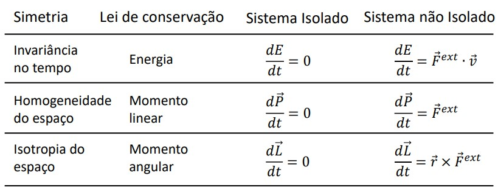

# Movimento de rotação de um corpo rígido num plano inclinado

## Usando a 2ª Lei de Newton

Partindo do sistema:

$$\begin{cases} F^{ext}=ma_{CM}\\ N^{ext}=I \gamma \end{cases}$$

Obtemos que:

$$a_{CM}=\frac{g\sin\theta}{(1+\frac{I}{mR^2})}$$

Sendo I o momento de inércia.

:::tip Nota:
Esta igualdade também pode ser obtida usando a conservação de energia ou o lagrangiano do sistema
:::

## {blue}(Resumo)

