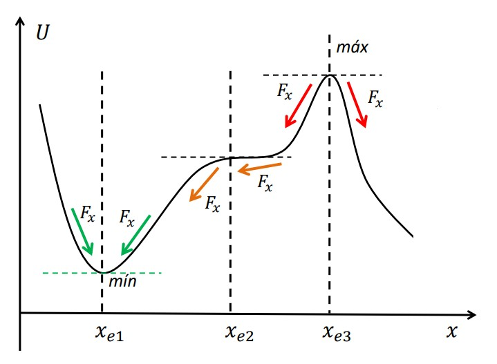
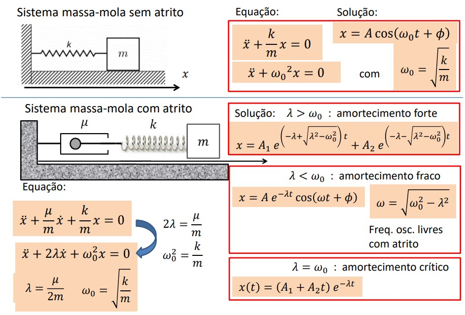
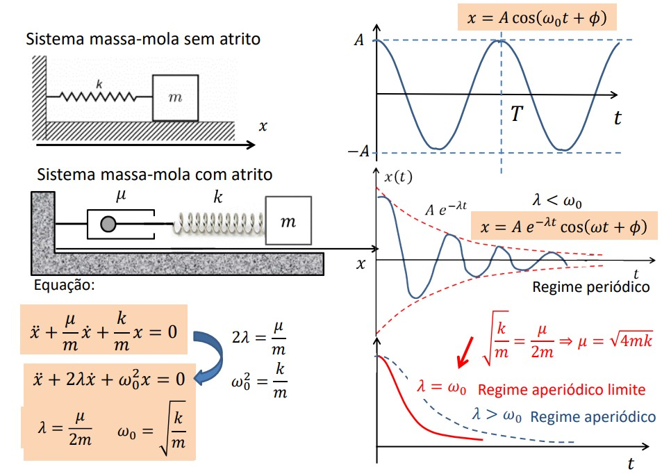

# Estabilidade e Movimentos Oscilatórios

## Estabilidade de um Sistema

### {green}(Mínimo - Equação **Estável**)

Para $x_{e_1}$ tem-se que:
$\begin{cases} F_x > 0 \text{ para } x < x_{e_1}\\ F_x < 0 \text{ para } x > x_{e_1} \end{cases}$

:::tip Nota:
Na vizinhança de um ponto de equilíbrio {green}(estável), a força tende a repor a condição de equilíbrio quando o sistema é afastado dessa condição.
:::

### {red}(Máximo - Equação **Instável**)

Para $x_{e_3}$ tem-se que:
$\begin{cases} F_x < 0 \text{ para } x < x_{e_1}\\ F_x > 0 \text{ para } x > x_{e_1} \end{cases}$

### {orange}(Ponto de Inflexão - Equação **Instável**)

Para $x_{e_2}$ tem-se que:
$\begin{cases} F_x < 0 \text{ para } x < x_{e_1}\\ F_x < 0 \text{ para } x > x_{e_1} \end{cases}$

## Oscilador Harmónico

Arbitrando $U_0 = 0$ e $x_e = 0$, temos que a {blue}(Energia Potencial do Oscilador Harmónico) é dada por:

$$U(x) \approxeq \frac{1}{2}kx^2 $$

:::tip Nota:
A Energia Mecânica total {green}(conserva-se) no movimento harmónico simples (sem atrito)

Ou seja, E = T + U = constante $\implies \frac{1}{2}mv^2 + \frac{1}{2}kx^2 = \text{constante}$
:::
