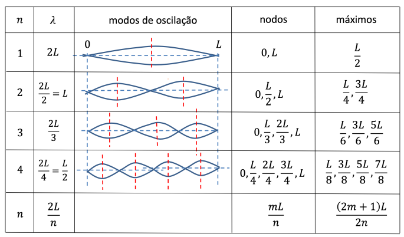

# Ondas

Existem vários tipos de ondas:

- **Ondas sonoras**: Propagação de oscilações locais da pressão e densidade de um meio material.

- **Ondas eletromagnéticas**: Propagação de oscilações do campo eletromagnético, propagam-se no vácuo.

- **Ondas sísmicas**: Propagação de vibrações das camadas da Terra.

- **Fenómeno ondulatório**: Propagação de energia através de um meio sem que haja transporte de massa.

## Onda Periódica

1. A perturbação corresponde ao fenómeno ondulatório que se repete periodicamente no espaço e no tempo.

2. A frequência é caracteristica do emissor (não varia com o tempo), e é inversa do período.

$$f = \frac{1}{T}$$

3. Condição de propagação

$$\phi(x, t) = \phi(x -vt)$$

4. Condição de periodicidade

$$\phi(x - vt) = \phi[(x + \lambda) -v(t + T)]$$

5. Velocidade de fase

$$v = \lambda f$$

## Propriedades das ondas

- **Onda longitudinal**: A grandeza física associada à onda varia no espaço segundo a direção de propagação. (Exemplo: som)

- **Onda transversal**: Grandeza fisica associada à onda varia no espaço segundo uma direção perpendicular à direção de propagação. (exemplo: onda eletromagnética) Estas ondas podem ser polarizadas segundo diferentes direções (no plano perpendicular à direção de propagação).

## Equação de uma onda (de uma corda vibrante)

$$ \frac{\partial^2y}{\partial^2x^2} - \frac{1}{v^2}\frac{\partial^2y}{\partial t^2} = 0$$
onde
$v = \sqrt{ \frac{T}{\mu}}$
onde T é a tensão e $\mu$ é a massa por unidade de tempo.

## Interferências

### Interferência construtiva

$$ \phi_1(x,t) = Asin(kx-wt), \phi_2(x,t) = Asin(kx - wt + \alpha)$$

Temos assim:

$$\phi(x,t) = \phi_1(x,t) + \phi_2(x,t) = 2Acos\frac{\alpha}{2}sin(kx - wt + \frac{\alpha}{2})$$

### Interferência Destrutiva

$$ \phi_1(x,t) = Asin(kx - wt), \phi_2(x,t) = Asin(kx - wt + \pi) = - \phi_1(x,t)$$

Logo $\phi(x,t) = \phi_1(x,t) + \phi_2(x,t) = 0$

### Ondas estacionárias

$$ \phi_1(x,t) = Asin(kx-wt), \phi_2(x,t) = Asin(kx + wt)$$

Temos:

$$\phi(x,t) = \phi_1(x,t) + \phi_2(x,t) = 2Asin(kx)cos(wt)$$

::: tip Fórmulas

$$\text{Frequência Angular: w} = \frac{2\pi}{T}$$

$$\text{Nº de onda: k} = \frac{2\pi}{\lambda}$$

$$\text{Relação de dispersão: w} = k \times v$$

$$\text{Velocidade de grupo: Vg} = \frac{\partial w}{\partial K}$$

:::

## Efeito Doppler

::: tip Definição

Alteração da frequência percecionada, ou medida, por um recetor devido ao movimento relativo entre esse recetor e uma fonte emissora.

- Afastamento entre fonte e recetor: Diminui a frequência.

- Aproximação entre fonte e recetor: Aumenta a frequência.

:::
