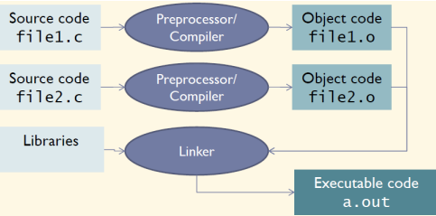
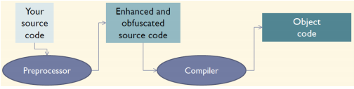
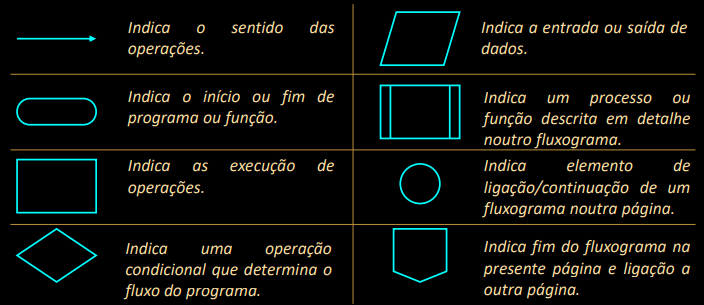

# Introdução

A **programação** consiste no desenvolvimento de programas (conjuntos de instruções que implementam algoritmos) escritos numa linguagem de programação específica.

## Linguagens de Programação
- **Liguagem Máquina**

    - Instruções Elementares
    - Dependente do Processador

- **Linguagens de Alto Nível de Abstracção**
    - Instruções Complexas
    - Independente do Processador

A **legibilidade dos programas** tende a aumentar em linguagens de mais alto nível de abstracção.

A **eficiência da execução** tende a aumentar em linguagens de mais baixo nível de abstracção.

### Linguagem C

O ciclo de desenvolvimento de um programa em C organiza-se em 4 fases:

• **Escrita do Código**: Nesta fase, o código é escrito em ficheiros com extensão .c

• **Compilação do Programa**: Nesta fase, o código é verificado pelo compilador e é gerado um ficheiro objecto com o nome do programa e extensão .o

• **Linkagem**: Nesta fase, é gerada um ficheiro executável, criado com base no ficheiro objecto anteriormente obtido e nas bibliotecas de funções do próprio C.

• **Execução do Programa**: Nesta fase, o programa é executado e testado do ponto de vista funcional.

A distribuição do código por **vários ficheiros** **ajuda a estruturar o programa** e
permite no caso de programas muito grandes com inúmeros ficheiros simplificar o
processo de compilação e poupar tempo.

De facto antes da compilação o código fonte é transformado/expandido de acordo
com as directizes definidas em linhas de código começadas com #.

### Fluxogramas
Um fluxograma é um diagrama que permite representar um algoritmo.
A utilização de fluxogramas é recomendável na fase definição das várias tarefas/funções/módulos a implementar para realizar uma aplicação.

