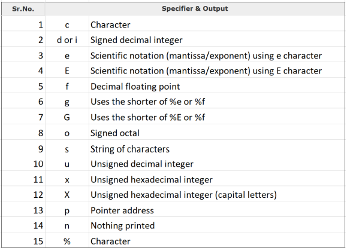
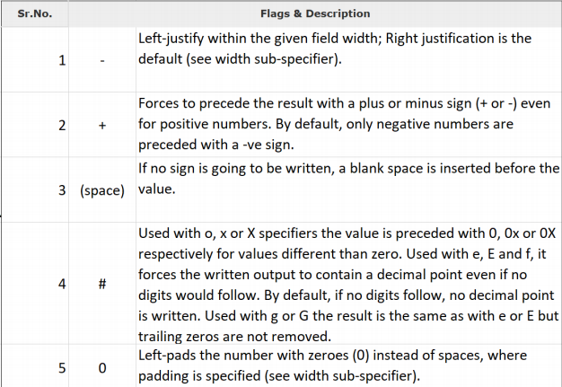

# 2. Estrutura de um Programa em C


## Léxico, Sintaxe e Semântica

**Nível Léxico**: Indica como os caracteres se combinam para produzir **elementos da linguagem**, e.g., i e f dão origem ao **if**. Em C temos vários tipos de elementos léxicos: Identificadores, Palavras-Chave, Constantes, Operadores, Separadores.

**Nível Sintático**: Indica como é que os elementos da linguagem se devem combinar para produzir expressões válidas, e.g.,
• **if (answer == 42)**
• **exit (1)**

**Nível Semântico**: Como as expressões se combinam para ter um determinado significado, e.g., sair do programa se a variável answer assumir o valor 42.

**Nota**: 2 programas escritos em linguagens diferentes podem realizar a mesma acção (semântica) mas utilizando símbolos diferentes para escrever o programa (sintaxe).

## Tokens

Um programa em C consiste numa sequência de tokens que podem ser keywords(palavras chave), identificadores, constantes, strings e símbolos. Por exemplo:

```c
printf("Hello, World! \n");
```

Tem os seguintes *tokens:*

```c
printf
(
"Hello, World! \n"
)
;
```

**Nota**: O “;” é o **terminador** de uma declaração em C.

## Comentários

Os **comentários** devem ser utilizados para documentar o programa, as funções e qualquer parte do código que seja suficientemente complexa ou abstracta tal que a simples leitura das instruções possa não ser suficiente para a sua compreensão.

**Não se devem utilizar comentários** para explicar instruções, isso, faz parte do conhecimento que se deve ter da linguagem!

Um comentário deve começar por “/*” e acabar com “*/”. Caso o comentário corresponda apenas a uma linha basta preceder o comentário de “//”.

```c
/* Nome do programa: HelloWorld
*
* Descrição: Este programa apenas imprime a mensagem "Hello world!"
* Autor: John Smith               Data: 28/02/2019               */
#include <stdio.h>
#include <stdlib.h>

int main()
{
print("Hello world! \n"); // comentário à linha
//outro comentário
return 0;
}
```

## Identificadores


Um identificador em C é um nome que permite identificar uma variável, uma função, etc. definida pelo utilizador.

Um identificador deve começar por uma letra maiúscula ou minúscula, ou um ‘_’ seguido por letras, ‘_’ ou dígitos de 0 a 9.

	NOTA 
	Não pode começar com um dígito.

## Palavras Chave

A linguagem C inclui um conjunto de palavras reservadas ou palavras-chave que não podem ser utilizadas como identificadores.


Todos os programas em C usam *libraries* que nos permitem executar certas funções tal como `printf`, que permite imprimir algo no ecrã. Para podermos usar a função `printf` devemos incluir a seguinte *library* no nosso código:

```c
#include <stdio.h>

int main() {
  *... our code goes here*
}
```

## Tipos de Dados

1) **Tipos Básicos-** Estes são tipos aritméticos e são classificados em: (a) tipos integer e (b) tipos floating-point

2) **Tipos Enumerados-** São tipos aritméticos e eles eram usados para definir variáveis aos quais só podem ser dados valores integer discretos ao longo do programa.

3) **Tipo void-** O especificador de tipo *void* indica que não há valor disponível.

4) **Tipo derivado-** Eles incluem: (a) Tipos Pointer, (b) Tipos Array, (c) Tipos Structure, (d) Tipos União, (e) Tipos Função

(a) Integers - números inteiros que podem ser negativos ou positivos: `char` , `short` ,`long` ,`int` ,`long long`

(b) Floating point numbers - números reais: `float` , `double`

Unsigned Integers - números inteiros positivos: `unsigned char` , `unsigned short` ,`unsigned long` ,`unsigned int`

String - Array de caracteres: `char name[ ]`

*Nota*: C não tem uma função de tipo booleano (Verdadeiro/Falso), por isso, usamos:

```c
#define BOOL char
#define FALSE 0
#define TRUE 1
```

### Dimensão


### void

1- **Function returns as void-** Há várias funções em C que não retornam nenhum valor ou pode-se dizer que retorna *`void`*. Uma função sem valor de retorno tem um tipo de retorno como `*void*`. Por exemplo**:**

```c
void exit (int status);
```

2- **Function arguments as `void`-** Há várias funções em C que não aceitam nenhum parâmetro. Uma função sem parâmetros pode aceitar um `void`. Por exemplo:

```c
int rand(void);
```

3- **Pointers to void-** Um pointer do tipo void * representa o endereço do objeto, mas não o seu tipo. Por exemplo, a função de alocação de memória:

```c
void *malloc( size_t size );
```

devolve um pointer para o void que se pode transformar noutro tipo de data.
## Tipos de Dados em Memória

### char (1 byte)

‘A’    <br />    65(10)     <br />      41(16)       <br />   01000001(2)

### Int (4 bytes)

2019(10)   <br /> 07E3(16)     <br />       00000000 00000000 00000111 11100011(2)

### float (4 bytes)

34.125(10) = 100010.001(2) =1.00010001(2) x 2^5
mantissa = 00010001 <br />
expoente = 101 … 5 + 127 = 132 = 10000100(2) <br />
sinal (1bit) expoente (8 bits) mantissa (23 bits)
0 10000100 00010001000000000000000 <br />

### double (8 bytes)

sinal (1bit) <br /> expoente (11 bits) <br /> mantissa (52 bits)

## Variáveis

- Case sensitive
- Costumam começar por uma letra ou underscore (_)

**Variável** é o nome dado a uma zona de memória que o programa pode manipular.

**Tipo de Variável** define a sua representação em memória e a gama de valores que pode representar.

**Definição de uma variável** segue o seguinte formato:

```c
#include <stdio.h>
#include <stdlib.h>

int main()
{
		// Variable_Type Variable_List;
		
		int a, b = 4, soma;
		float media;

		a = 5;
		soma = a + b;
		media = (float) soma/2; //o float está aqui para interpretar a soma como float para conseguir calcular

		printf("a + b = %d\n", soma);
		printf("media(a,b) = %.2f\n", media);

		return 0;
}
```


## Constantes

A definição de constantes pode ser feita de 2 formas: (1) como indicação de preprocessamento através da utilização de #define; (2) em runtime com a utilização do prefixo `const`.

```c
#define identificador valor

ou

const tipo identificador = valor;
```

```c
#include <stdio.h>
#include <stdlib.h>

#define LARGURA 100
#define NEWLINE '\n'

int main()
{
		// Variable Type Variable List;

		const int COMPRIMENTO = 20;
		int perimetro, area;
		
		perimetro = 2 * LARGURA + 2 * COMPRIMENTO;
		
		printf("perimetro = %d\n", perimetro)
		printf("area = &d\n", LARGURA*COMPRIMENTO)

		return 0;
}
```


## Classes de Armazenamento

**`Auto`**: Esta é a classe de armazenamento por omissão.

**`Register`**: A classe de armazenamento **`register`** indica que a variável local é armazenada num registo em vez de na RAM. Para variáveis que requerem acesso rápido como contadores. Neste caso, não faz sentido a utilização do operador unário & uma vez que a variável não está em memória. Tipo de dados limitado à dimensão dos registos.

```c
#include <stdio.h>
#include <limits.h>

int main()
{
		register int i;
		
		for (i=0;i<INT_MAX;i++);

		printf("Hello world!\n");
		return 0;
}
```


### Extern

**`Extern`**: Utilizada quando a variável ou função está declarada noutro ficheiro.
       `extern` *tipodedados nomevariável*;

`$gcc main.c support.c`

**Primeiro ficheiro: main.c**

```c
#include <stdio.h>

int count;
extern void write_extern();

main() {
		count =5;
		write_extern();
}
```

**Segundo ficheiro: support.c**

```c
#include <stdio.h>

extern int count;

void write_extern(void) {
printf("count is %d\n", count)
}
```

## Operadores Aritméticos

| Operador | Descrição |
| -------- | --------- |
| +        | Adds two operands|
| -        | Subtracts second operand from the first |
| * | Multiplies both operands |
| / | Divides numerator by de-numerator |
| % | Modulus Operator and remainder of after an integer division |
| ++ | Increment operator increases the integer value by one |
|  -- | Decrement operator decreases the integer value by one |
<br />

```c

#include <stdio.h>
#include <stdlib.h>

int main()
{
		int x, y;
		short z;
		
		printf("Operadores Aritméticos!\n");
		printf("x = %d, y = %d, z = %d\n", x, y, z);
		x = 1024;
		y = 33;
		printf("x = %d, y = %d\n", x, y, z);
		printf("x + y = %d\nx - y = %d\n", x+y, x-y);
		printf("x * y = %d\n", x*y, x/y);
		printf("x = %d, y = %d\n", x, y);
		z = x*y;
		printf("z = x * y = %d\n", z);
		printf("++x = %d\n", ++x);
		printf("x = %d\n", x);
		printf("x = %d\n", x);
		printf("x++ = %d\n", x++);
		printf("x = %d\n", x)
		return 0
}

```

## Operadores Relacionais
A = 10 <br />
B = 20
| Operador | Descrição | Exemplo |
| -------- | --------- | ------- |
| == | Checks if the values of two operands are equal or not. If yes, then the condition becomes true. | (A == B) is not true. |
| != | Checks if the values of the two numbers are equal or not. If the values are not equal, then the condition becomes true. | (A ! = B) is true. |
| > | Checks if the value of the left operand is greater than the value of right operand. If yes, then the condition becomes true. | (A > B) is not true. | (A < B) is true. |
| < | Checks if the value of the left operand is less than the value of right operand. If yes, then the condition becomes true. | (A < B) is true. |
| >= | Checks if the value of the left operand is greater than or equal to the value of right operand. If yes, then the condition becomes true. | (A >= B) is not true |
| <= | Checks if the value of the left operand is less than or equal to the value of right operand. If yes, then the condition becomes true. | (A <= B) is not true |

<br />

## Operadores Lógicos
A = 1 <br />
B = 0
| Operador | Descrição | Exemplo |
| -------- | --------- | ------- |
| && | Called Logical AND Operator. If one of the two operands is non-zero, then the condition becomes true. | (A && B) is false. |
| \|\| | Called Logical OR Operator. If any of the two operands is non-zero, then the condition becomes true. | (A \|\| B) is true. |
| ! | Called Logical NOT Operator. It is used to reverse the logical state of its operand. If a condition is true, then Logical NOT operator will make it false. | !(A && B) is true. |

## Operadores Bitwise
A = 60(10) = 0011 1100(2) <br />
B = 13(10) = 0000 1101 (2)
| Operador | Descrição | Exemplo |
| -------- | --------- | ------- |
| & | Binary AND Operator copies a bit to the result if it exists in both operands. |(A & B) = 12, i.e., 0000 1100|
| \| | Binary OR Operator copies a bit if it exists in either operand. |(A | B) = 61, i.e., 0011 1101|
| ^ | Binary XOR Operator copies the bit if it is set in one operand but not both. |(A ^ B) = 49, i.e., 0011 0001|
| ~ | Binary One's Complement Operator is unary and has the effect of 'flipping' bits. |(~A) = ~(60), i.e., -0111101 **-61**|
| << | Binary Left Shift Operator. The left operands value is moved left by the number of bits specified by the right operand. |A << 2 = 240, i.e., 1111 0000|
| >> | Binary Right Shift Operator. The left operands value is moved right by the number of bits specified by the right operand. |A >> 2 = 240, i.e., 0000 1111|

## Operadores de Atribuição

| Operador | Descrição |
| -------- | --------- |
| = | Simple assignment operator. Assigns values from right side operands to left side operand. |
| += | Add AND assignment operator. It adds the right operand to the left operand and assign the result to the left operand. |
| -= | Add AND assignment operator. It subtracts the right operand to the left operand and assigns the result to the left operand. |
| *= | Multiply AND assignment operator. It multiplies the right operand with the left operand and assigns the result to the left operand. |
| /= | Divide AND assignment operator. It divides the left operand with the right operand and assigns the result to the left operand. |
| %= | Modulus AND assignment operator. It takes modulus using two operands and assigns the result to the left operand. |
| <<= | Left shift AND assignment operator. |
| >>= | Right shift AND assignment operator. |
| &= | Bitwise AND assignment operator. |
| ^= | Bitwise exclusive OR and assignment operator. |
| \|= | Bitwire inclusive OR and assignment and assignment operator. |

```c
#include <stdio.h>
#include <stdlib.h>

int main()
{
		int x, y, z;

		printf("Operadores de Atribuição:\n");
		printf("x = %d, y = %d\n", x, y);
		x = 1024;
		y = 33;
		printf("x = %d, y = %d\n", x, y);
		x -= y;
		printf("x = x - y = %d\n", x);
		y += x;
		printf("y = y + x = %d\n", y);
		y *= x;
		printf("x = x * y", x);
		z = x / 2 * y;
		x /= 2 * y; // * é mais prioritário do que /=
		printf("x = x / (2 * y) = %d\nz = x / 2 * y = %d", x, z);
		return 0;
}
```


## Operadores
| Operador | Descrição |
| -------- | --------- |
| sizeof() | Returns the size of a variable |
| & | Returns the address of a variable |
| * | Pointer to a variable |
| ? : | Conditional Expression |
<br />

### Precedência de operadores

| Nome | Operadores | Associatividade |
| ---- | ---------- | --------------- |
| Postfix | () []  ->  .  ++  -- | Left to right |
| Unary | +  -  !  ~  ++  --  (type)*  &  sizeof | Right to Left |
| Multiplicative | *  /  % | Left to right |
| Additive | +  - | Left to right |
| Shift | << >> | Left to right |
| Relational | <  <=  >  >= | Left to right |
| Equality | ==   != | Left to right |
| Bitwise AND | & | Left to right |
| Bitwise XOR | ^ | Left to right |
| Bitwise OR | \| | Left to right|
| Logical AND | && | Left to right |
| Logical OR | \|\| | Left to right |
| Conditional | ?: | Right to left |
| Assignment | =  +=  -=  *=  /=  %=  >>=  <<=  &=  ^=  \|= | Right to left |
| Comma | , | Left to right |
<br />
## I/O (Input/Output)

O C trata todos os dispositivos como ficheiros.
A execução de um programa leva à abertura automática dos 3 ficheiros:
• Standard input
• Standard output
• Standard error


Funções `getchar()` e `putchar()`
• `int getchar(void)` - lê um caractere e retorna um inteiro (unsigned char) ou EOF.
• `int putchar(int c)` - escreve um caractere e retorna um inteiro (unsigned char) ou EOF.

```c
#include <stdio.h>
int main( ) {
		int c;
		printf( "Enter a value :");
		c = getchar( );

		printf( "\nYou entered: ");
		putchar( c );

	return 0;
}
```


```c
#include <stdio.h>
int main( )
{
		int c, i;
		
		printf( "Enter a value :" );
		
		for(i=0;i<4;i++)
		{
		c = getchar( );
		printf( "\nYou entered: " )
		putchar( c );
		
		}
  return 0;
}
```


Funções `gets()` e `puts()`
• `char * gets(char *s)` – lê string até newline of EOF. Retorna uma string ou NULL em caso de erro
• `int puts(const char *s)` – escreve uma string no stdout sem o caractere null, adiciona um newline no fim da string. Retorna um valor não negativo ou EOF em caso de erro.

```c
#include <stdio.h>
int main( ) {

		char str[100];

		printf("Enter a value : ");
		gets( str );

		printf("\nYou entered: ");
		puts( str );

		return 0;
}
```

<br />
Funções `scanf()` e `printf()`
• `int scanf(const char *format, ...)` - permite ler uma entrada de acordo com o formato especificado. Retorna o número total de caracteres lido ou um valor negativo em caso de erro.
• `int printf(const char *format, ...)` - permite imprimir uma saída de acordo com o formato especificado. Retorna o número total de caracteres lido ou um valor negativo em caso de erro.

```c
#include <stdio.h>
int main( ){

		char str[100];
		int i;

		printf( "Enter a value :");
		scanf("%s %d", str, &i);		

		printf( "\nYou entered: %s %d", str, i);

		return 0;
}
```


`int printf(const char *format, ...)`
`string` incluindo a formatação dos argumentos

`%[flags][width][.precision][length]specifier`





`int scanf(const char *format, ...)`

string incluindo a formatação dos argumentos

`[=%[*][width][modifiers]type=]`


```c
#include <stdio.h>
#include <stdlib.h>

int main()
{
		int i;

		printf("Insira um inteiro: ");
		scan("%d", &i);
		printf("\nValor lido: &d\n",i);

		printf("Insira um inteiro com mais de 3 dígitos: ");
		scanf("%3d", &i);
		printf("\nValor lido: %d\n", i);

		return 0
}
```
## Caractere Especial \

A utilização do caractere especial \ permite definir o que se designam por **escape sequences** que permitem: (1) alterar o significado especial de um caracter como “que deixa de ser interpretado como delimitador e passa a ser simplesmente o caractere “; (2) representar caracteres especiais como \n que significa mudança de linha.

	NOTA 
	\a Alarm or Beep
	\b Backspace
	\f Form Feed
	\n New Line
	\r Carriage Return
	\t Tab (Horizontal)
	\v Vertical Tab
	\\ Backslash
	\' Single Quote
	\" Double Quote
	\? Question Mark
	\ooo octal number
	\xhh hexadecimal number
	\0 Null

```c
#include <stdio.h>
#include <stdlib.h>

int main()
{
		printf("Hello World!\n");
		printf("\nMEEC 20192020\b\b\b\b/2020 \n\n");
		printf("AED\a \r");
		printf("Programação\n");
		printf("\t *****\n")
		printf("\v\t*******\n");
		return 0;
}
```