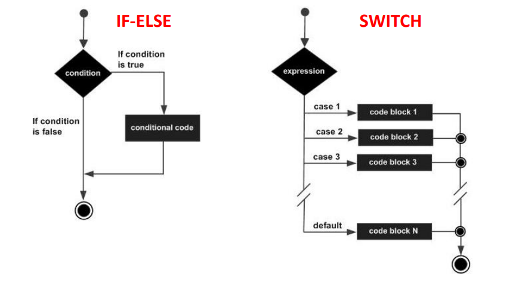
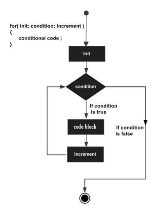

# 3- Controlo de Fluxo

## Instruções IF-ELSE e SWITCH

As instruções IF-ELSE e SWITCH permitem avaliar condições e desse modo
condicionar o fluxo do programa.



### Instrução IF

An **if statement** consists of a boolean expression followed by one or more statements.


```c
if(boolean_expression) {
	/* statement(s) will execute if the boolean expression is true*/
}
```

```c
#include <stdio.h>
int main () {
	
	/* local variable definition */
	int a = 10;

	/* check the boolean condition using if statement */
	if( a < 20 ) {
		/* if condition is true then print the following */
		printf("a is less than 20\n");
}

	printf("value of a is : %d\n", a);

	return 0;
}
```


### Instrução IF-ELSE

An **if statement** can be followed by an optional **else statement**, which executes when the Boolean expression is false.


```c
if(boolean_expression) {
	/* statement(s) will execute if the boolean expression is true*/
} else {
	/* statement(s) will execute if the boolean expression is false*/
}
```

```c
#include <stdio.h>
int main () {
	
	/* local variable definition */
	int a = 100;

	/* check the boolean condition using if statement */
	if( a < 20 ) {
		/* if condition is true then print the following */
		printf("a is less than 20\n");
} else {
		/* if condition is false then print the following */
		printf("a is not less than 20\n");
}

	printf("value of a is : %d\n", a);

	return 0;
}
```


### Instrução IF-ELSE encadeado

You can use one **if**  or **else if statement** inside another if or else if statement(s).

```c
if(boolean_expression 1) {
	/* Executes when the boolean expression 1 is true */
} else if( boolean_expression 2) {
	/* Executes when the boolean expression 2 is true */
} else if( boolean_expression 3) {
	/* Executes when the boolean expression 3 is true */
} else {
	/* executes whem none of the conditions above is true */
}

```

```c
#include <stdio.h>
int main () {
	
	/* local variable definition */
	int a = 100;

	/* check the boolean condition using if statement */
	if( a == 10 ) {
		/* if condition is true then print the following */
		printf("Value of a us 10\n");
} else if( a == 20) {
		/* if else if condition is true */
		printf("Value of a is 20\n");
} else if (a == 30) {
	/* if else if condition is true */
		printf("None of the values is matching\n" );
} else {
 /*if none of the conditions is true*/
 printf("None of the values is matching" );
}

	printf("Exact value of a is : %d\n", a);

	return 0;
}
```


```c
#include <stdio.h>

int main () {

	// local variable definition
	int a = 100;
	int b = 200;

	//check the boolean condition
	if( a == 100 ){

		//if confidition is true then check the following
		if( b==200 ){
			
			//if condition is true then print the following 
			printf("Value of a is 100 and b is 200\n");
		}
	}

printf("Exact value of a is : %d\n", a );
printf("Exact value of b is : %d\n", b);

return 0;
}
```


### Instrução SWITCH

A **switch** statement allows a variable to be tested for equality against a list of values.


```c
switch(expression){
	
	case constant-expression :
		statement(s);
		break; /* optional */
	case constant-expression :
		statement(s);
		break; /* optional */

	/* you can have any number of case statements */
	default : /* optional */
	statement(s);
}
```


```c
#include <stdio.h>

int main(){

	/* local variable definition */
	int a = 100;
	int b = 200;

	switch(a) {
		case 100:
			printf("This is part of outer switch\n", a );

			switch(b) {
				case 200:
					printf("This is part of inner switch\n", a );
			}
	}
	
	printf("Exact value of a is : %d\n", a );
	printf("Exact value of b is : %d\n", b );

	return 0;
}
```


## Ciclos: WHILE, FOR e DO WHILE

As instruções WHILE, FOR e DO WHILE permitem implementar ciclos e, desse modo, repetir a execução de um bloco de código enquanto se verifique uma determinada condição.


### Introdução WHILE


Repeats a statement or group of statements while a given condition is true. It tests the condition before executing the loop body.

```c
while(condition) {
	statement(s);
}
```

### Instrução FOR

```c
for ( init; condition; increment ) {
	statement(s);
}
```




### Instrução DO … WHILE

It is more like a while statement, except that it tests the condition at the end of the loop body.

```c
do{
	statement(s);
} while( condition );
```


### Ciclos Encadeados

You can use one or more loops inside any other while, for, or do... while loop.

```c
for ( init; condition; increment ) {
	for( init; condition; increment ) {
		statement(s);
	}
	statement(s);
}
```

```c
while(condition) {

	while(condition) {
		statement(s);
	}
	statement(s);
}
```

```c
do {
	statement(s);

	do{
		statement(s);
	}while( condition );

}while( condition );
```

### Instrução BREAK

Terminates the **loop** or **switch** statement and transfers execution to the statement immediately following the loop or switch.

A instrução **BREAK** termina o ciclo ou o **SWITCH** que esteja a executar.


