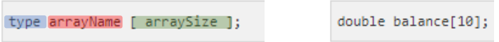
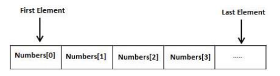
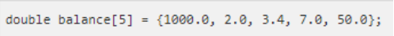
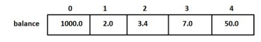
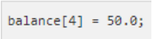
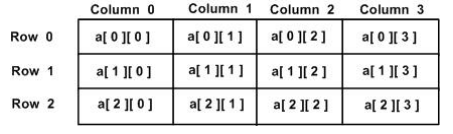
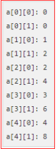
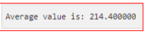
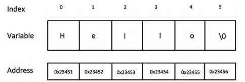
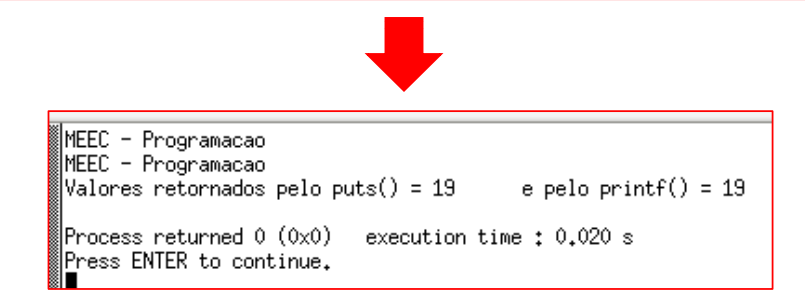

# 5- Arrays (Vectores):

## Declaração

Um array/vector é uma estrutura de dados que permite armazenar sequencialmente um conjunto de n elementos de um determinado tipo de dados. 
A definição de um array/vector envolve as seguintes partes:
type: type indica o tipo de dados associado ao array/vector. O tipo pode ser qualquer
tipo de dados do C.
array_name: array_name é o nome da variável que deve respeitar as regras para escrita de identificadores.
array_size: array_size corresponde ao número de elementos do array/vector e deve ser um inteiro.



O acesso aos vários elementos do array é realizado através de um índice que varia entre 0 e n-1 (sendo n o nº de elementos do array).



## Inicialização

A inicialização do array/vector pode ser realizada na declaração, neste caso, para todos os elementos do array ou para um elemento individual do array utilizando um  operador de atribuição.



A não especificação do número de elementos do array implica que sejam criados  tantos elementos quantos os elementos inicializados.



No decorrer do programa cada elemento do array é utilizado como uma qualquer outra variável, contudo, deve-se ter em conta a especificação do índice para acesso ao elemento pretendido.



    Inicializar as variáveis SEMPRE!

## Multidimensionais

Um array na sua forma geral pode ser definido com n dimensões. Um array multidimensional pode ser visto como uma lista de arrays unidimensionais.

```c
type name[size1][size2]...[sizeN];
```

```c
int threedim[5][10][4];
```

Arrays bidimensionais podem, por exemplo, ser utilizados para implementar operações matriciais.

```c
type arrayname[ x ][ y ];
```

```c
int a[3][4] = {
	{0, 1, 2, 3} , //initializers for row indexed by 0
	{4, 5, 6, 7} , //initializers for row indexed by 1
	{8, 9, 10, 11} , //initializers for row indexed by 2
};
```

```c
int a[3][4] = {0,1,2,3,4,5,6,7,8,9,10,11}
```



Exemplo de declaração de um array de inteiros de 10 elementos (5*2), da atribuição de valores a estes elementos e do posterior acesso a esses elementos.

```c
#include <stdio.h>

int main () {
	//an array with 5 rows and 2 columns
	int [5][2] = { {0,0}, {1,2}, {2,4}, {3,6}, {4,8} };

	// output each array element's value
	for ( i = 0; i < 5; i++ ){
		
		for( j = 0; j < 2; j++ ){
			printf("a[%d][%d] = %d\n", i, j, a[i][j]);
		}
	}
	return 0;
}
```



## Como Argumentos de Funções

Para passar arrays como argumentos para uma função pode utilizar qualquer dos 3 métodos ilustrados em baixo, para o caso de um array de inteiros. Em qualquer dos casos é indicado ao compilador que a função irá receber um apontador para um inteiro (apontador para o primeiro elemento do array/vector).

```c
void myFunction(int *param) {
	.
	.
	.
}
```

```c
void myFunction(int param[10]) {
	.
	.
	.
}
```

```c
void myFunction(int param[]) {
	.
	.
	.
}
```

```c
#include <stdio.h>

//function declaration
double getAverage(int arr[], int size);

int main(){

	// an int array with 5 elements
	int balance[5] = {1000, 2, 3, 17, 50};
	double avg;

	//pass pointer to the array as an argument
	avg = getAverage( balance, 5 ) ;

	//output the returned value
	printf( "Average value is: %f", avg );
	return 0;
}

double getAverage(int arr[], int size){

	int i;
	double avg;
	double sum = 0;

	for (i = 0; i < size; i++){
		sum += arr[i];
	}

avg = sum / size;

return avg;
}
```



    NOTA
    A utilização de vectores permite agregar um conjunto de n variáveis com uma mesma designação ou identificador, sendo distinguidas por um índice entre 0 e n-1.
    Neste caso ilustra-se a utilização de um vector para guardar as componentes de avaliação de 1 aluno.

## Strings

### Declaração e Inicialização

Uma string é um conjunto de caracteres armazenado num vector … mas um vector de caracteres pode não ser uma string. Uma string é um sequência de caracteres terminado com o caracter `\0` **(null)**.
A declaração da string segue o mesmo formato que o dos vectores.

```c
type arrayName [ arraySize ];
```

```c
char greeting[6] = {'H', 'e', 'l', 'l', 'o', '\0'};
char greeting[] = "Hello";
```

A representação da string em memória é a seguinte, isto é, uma sequência de bytes cada um correspondendo a um elemento do vector de caracteres especificado com o caractere `\0` no fim.



### Escrita

A escrita de strings é realizada pelas funções `printf()` e `puts()`. A função `printf( )` permite escrever directamente ou como qualquer outra variável utilizando o formato próprio %s. A função puts() permite apenas a escrita de strings sejam constantes ou estejam armazenadas em variáveis. A função `puts( )` realiza automaticamente uma mudança de linha após a escrita da string.

```c
int printf(const char *format, ...)
```

A função `printf()` retorna o número total de caracteres escritos ou um valor negativo em caso de erro. A função `puts()` retorna um valor positivo ou EOF em caso de erro.

```c
#include <stdio.h>
#include <stdio.h>

int main()
{
	char str[50] = "MEEC - Programação";
	int ret_puts, ret_printf;

	ret_puts = puts(str);
	ret_printf = printf("%s\n", str);

	printf("Valores retornados pelo puts() = %d\t e pelo printf() = %d\n", ret_puts, ret_printf);

	return 0;
}
```

