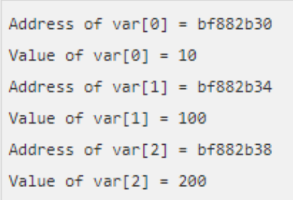
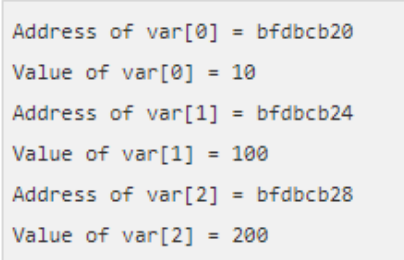
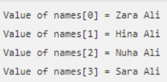
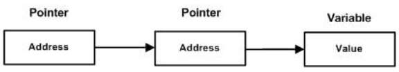
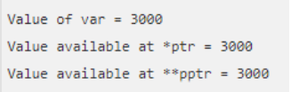
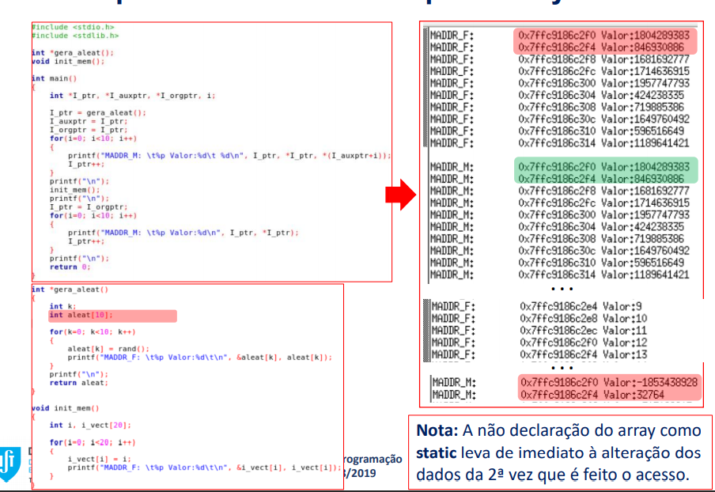

# Pointers (Apontadores):

### Declaração:

Os pointers/apontadores são variáveis cujo valor é o endereço de memória de outra variável. A utilização de apontadores facilita muitas tarefas em C e são fundamentais para tarefas relacionadas com alocação dinâmica de memória (a estudar mais à frente).
A declaração de apontadores faz de acordo com o seguinte formato: **type** é o tipo base do apontador (embora o apontador guarde um endereço, esta informação é relevante para avançar para outro elemento do mesmo tipo por incremento do apontador); **varname** é o nome da variável; * serve para identificar a variável como um apontador.

```c
type *var-name
```

```c
int       *ip;     /* pointer to an integer */
double    *dp;     /* pointer to a double */
float     *fp      /* pointer to a float */
char      *ch;     /* pointer to a character */
```

### Inicialização

A inicialização com o valor `NULL` é uma boa prática para evitar a utilização de endereços indesejados. Assume-se que se o pointer tem o valor `NULL` (zero) não aponta para nada.

```c
#include <stdio.h>

int main (){

	int *ptr = NULL;

	printf("The value of ptr is: %x\n", ptr );

	return 0;
}
```


```c
if(ptr)    /* succeeds if p is not null */
if(!ptr)   /* succeeds if p os null */
```

## Pointers: Aritmética (Incremento)

A aritmética dos apontadores permite utilizar os operadores ++, --, + e -. As operações aritméticas actualizam o apontador tendo em conta o tipo de dado para o qual apontam.

```c
#include <stdio.h>

const int MAX = 3;

int main () {

	int var[] = {10, 100, 200};
	int i, *ptr;

	/* let us have array address in pointer */
	ptr = var;

	for( i = 0; i < MAX; i++ ){
		
		printf(" Address of var[%d] = %x ", i, ptr);
		printf("Value of var[%d] = %d\n", i, *ptr);

		/* move to the next location */
		ptr++;
	}

	return 0;
}
```



Se usássemos -- iria para a posição anterior.

### Comparação

A comparação de apontadores permite utilizar os operadores relacionais ==, > e <.

```c
#include <stdio.h>

const int MAX = 3;

int main () {

	int var[] = {10, 100, 200};
	int i, *ptr;

	/* let us have address of the first element in pointer */
	ptr = var;

	while( ptr <= &var[MAX - 1] ){
		
		printf(" Address of var[%d] = %x ", i, ptr);
		printf("Value of var[%d] = %d\n", i, *ptr);

		/* point to the previous location */
		ptr++;
		i++
	}

	return 0;
}
```



## Arrays de Apontadores (Números)

Um array de apontadores define-se de forma semelhante aos restantes arrays. O exemplo ilustra um **array/vector de apontadores para inteiros**.

```c
#include <stdio.h>

const int MAX = 3;

int main () {

	int var[] = {10, 100, 200};
	int i, *ptr[MAX];

	for ( i = 0; i < MAX; i++ ){
		ptr[i] = &var[i]M /* assign the address of integer. */
	}
		
	for ( i = 0; i < MAX; i++ ){
		printf("Value of var[%d] = %d\n", i, *ptr[i] );
	}

	return 0;
}
```

## Arrays de Apontadores (Chars)

Neste caso, ilustra-se um **array/vector de apontadores para caracteres para armazenar uma lista de strings**. Note que em C uma string é um apontador para chars.

```c
#include <stdio.h>

const int MAX = 4;

int main () {

	char *names[] = {
		"Zara Ali",
		"Hina Ali",
		"Nuha Ali",
		"Sara Ali"
	};

	int i = 0;

	for ( i = 0M i < MAX; i++ ) {
		printf("Value of names[%d] = %s\n", i, names[i] );
	}

	return 0;
}
```



## Pointer para Pointer



```c
int **var
```

```c
#include <stdio.h>

int main() {
	
	int var;
	int *ptr;
	int **pptr;

	var = 3000;

	/* take the address of var */
	ptr = &var;

	/* take the address of ptr using address of operator & */
	pptr = &ptr;

	/* take the value using pptr */
	printf("Value of var = %d\n", var);
	printf("Value available at *ptr = %d\n", *ptr );
	printf("Value available at **pptr = %d\n", **pptr);

	return 0;
}
```

```c
#include <stdio.h>

int main() {
	
	int var;
	int *ptr;
	int **pptr;

	var = 3000;

	/* take the address of var */
	ptr = &var;

	/* take the address of ptr using address of operator & */
	pptr = &ptr;

	/* take the value using pptr */
	printf("Value of var = %d\n", var);
	printf("Value available at *ptr = %d\n", *ptr );
	printf("Value available at **pptr = %d\n", **pptr);

	return 0;
}
```


## Passagem de Pointers para Função

Passing an argument by reference or by address enable the passed argument to be changed in the calling function by the called function.

```c
#include <stdio.h>
#include <time.h>

void getSeconds(unsigned long *par);
int main (){
	
	unsigned long sec;
	getSeconds( &sec );
	
	return 0;
}

void getSeconds(unsigned long *par)
{
	/* get the current number of seconds */
	*par = time(NULL);
	return;
}
```

## Retornar Pointers de Funções

C allows a function to return a pointer to the local variable, static variable, and dynamically allocated memory as well.

