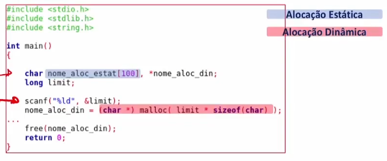

# 7- Alocação Dinâmica de Memória

## Estrutura de Memória de um Programa em C:

A estrutura de memória de um programa em C encontra-se organizada em vários segmentos com as seguintes designações e características:

- **Text/Code Segment**: Neste segmento encontra-se o código máquina do programa compilado. Este segmento deve ter acesso tipicamente só de leitura para evitar que o programa seja destruído ou acidentalmente modificado.
- **Intialized Data Segment (Data Segment)**: Neste segmento, são guardadas todas as variáveis globais, estáticas (static), constantes, (constant) e variáveis externas(extern) inicializadas. Este segmento tem secções de acesso para escrita e leitura, e de acesso só para leitura (caso das variáveis declaradas como const).
- **Uninitialized Data Segment (bss - “block started by symbol” ):** Neste segmento, armazenam-se todas as variáveis globais e estáticas inicializadas a 0 ou não inicializadas.
Stack Segment: Este segmento é utilizado para guardar todas as variáveis locais, para passar os argumentos para funções e para guardar o endereço de retorno. O Stack tem um acesso do tipo LIFO, i.e., Last In First Out.
- **Heap Segment**: Neste segmento, é onde se realiza a alocação dinâmica de memória.


A utilização do comando size permite determinar o espaço ocupado pelo programa ao nível dos 3 segmentos (texto, data e bss).


A gestão de memória na execução de um programa deve ser feita de forma eficiente.
• **Alocação Estática**: A reserva de espaço de memória por definição da dimensão das variáveis durante a fase de programação designa-se por alocação estática uma vez que não é alterada durante a fase de execução.
• **Alocação Dinâmica:** A reserva de espaço de memória durante a execução do programa em função da execução designa-se por alocação dinâmica e requer a utilização de apontadores para a zona de memória alocada. 

A **alocação dinâmica** permite uma gestão mais eficiente da memória uma vez que  apenas se precisa de manter alocada a memória estritamente necessária e toda a  restante pode ser libertada.



## void *calloc(int num, int size);

A função `calloc()` permite alocar dinamicamente um bloco de memória de n bytes, tal como o `malloc()` e retorna um apontador para esse bloco. Neste caso, `calloc()`, a memória é inicializada a zero.

•O argumento sizecorresponde à dimensão em bytes de cada elemento a alocar.•O argumentonitemscorresponde ao número de elementos a alocar.•A função retorna um apontador para o bloco de memóriaou NULL, caso não consiga alocar a memória.


## void free(void *address);

A função `free()` permite libertar a memória previamente alocada pelas instruções `malloc()`, `calloc()` ou `realloc()`. A libertação de memória é fundamental para a utilização eficiente da alocação dinâmica.
```c
void free(void *ptr);
```

•O argumento ***ptr** é o apontador para o bloco de memória previamente alocado que se pretende desalocar. Caso seja um apontador para `null` não é realizada qualquer operação.
    
    NOTA
    Se precisarmos de utilizar um apontador para percorrer o bloco de memória:
    - Voltar a posicionar o apontador no início do bloco de memória;
    - Utilizar um apontador auxiliar.


## void *malloc(int num);

A função `malloc()` permite alocar dinamicamente um bloco de memória de n bytes e retorna um apontador para esse bloco. 

```c
void *malloc(size_t size)
```

•O argumento sizecorresponde à dimensão do bloco de memória em bytes.

•A função retorna um apontador para o bloco de memóriaou NULL, caso não consiga alocar a memória.

•Dado que a função mallocretorna um apontador para voiddeve ser feita uma conversão de tipo para garantir a correctautilização do apontador para a zona de memória alocada.

```c
void *str;

/* Initial memory allocation */
str = (char *) malloc(15);
```

A validação do sucesso da operação de alocação dinâmica é fundamental para a correctaexecução do programa.


## void *realloc(void *address, int newsize);

A função `realloc()` permite reajustar a dimensão de um bloco previamente alocado com as funções `malloc()`, `calloc()` ou `realloc()`

```c
void *realloc(void *ptr, size_t size)
```

•O argumento **size** corresponde à dimensão do bloco de memória a alocar. Caso seja 0 e ptraponte para um bloco existente o bloco de memória é desalocado e retorna um apontador para NULL. 

•O arg. ***ptr** é um apontador para um bloco de memória previamente alocado.

•A função retorna um **apontador para o bloco de memória** ou **NULL**, caso não consiga alocar a memória.