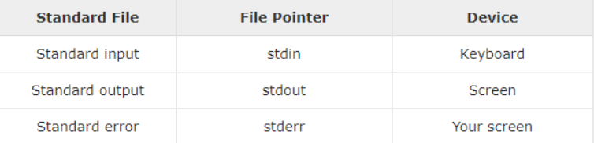
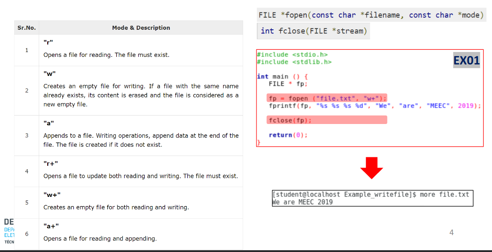
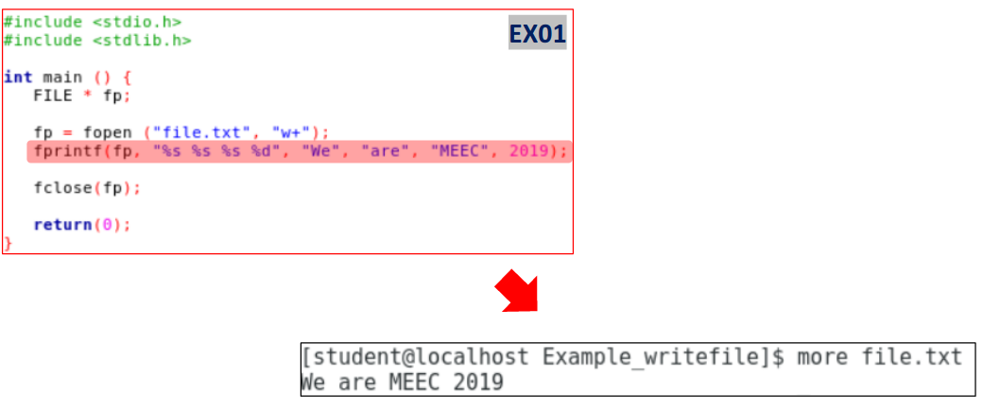
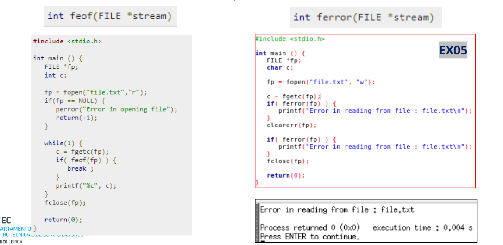
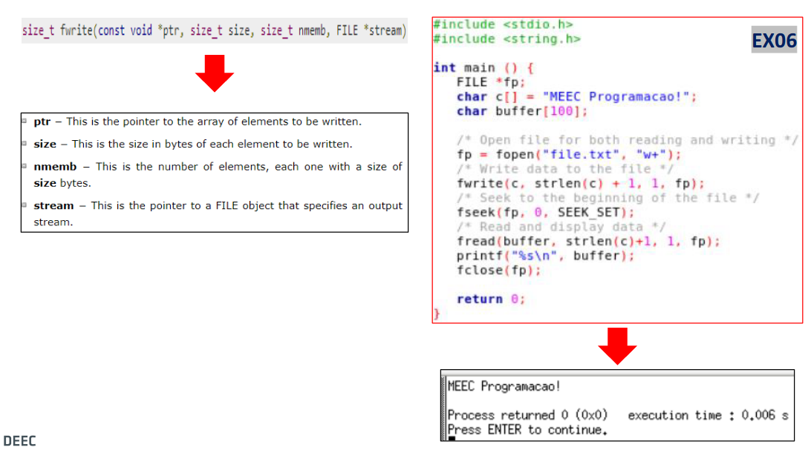
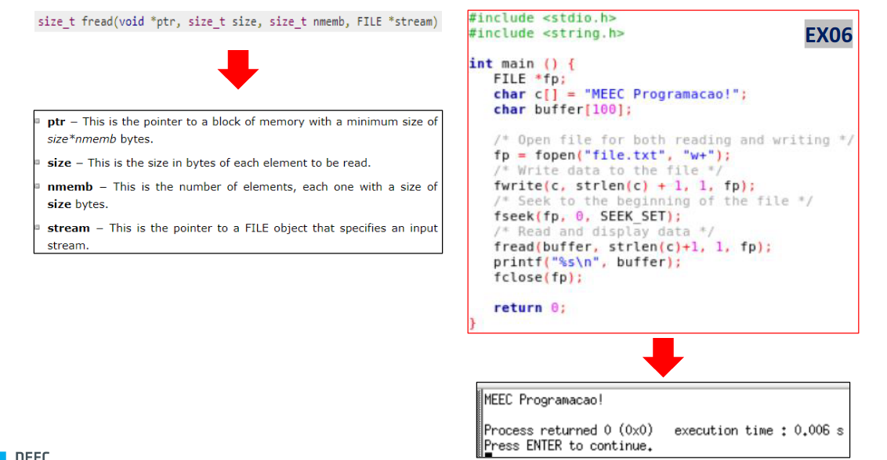
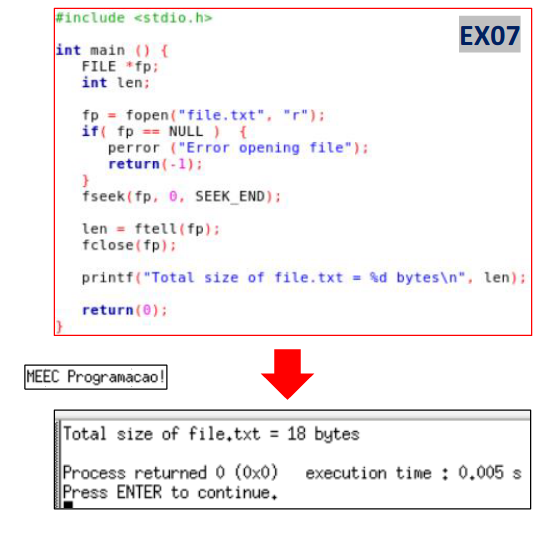
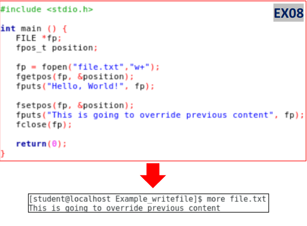
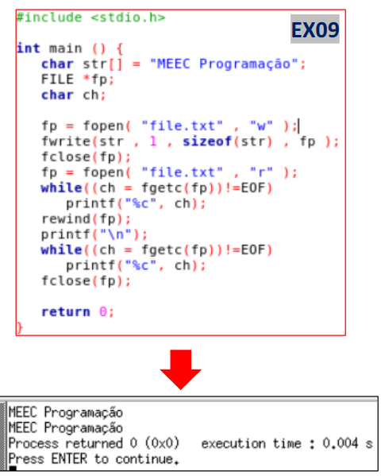
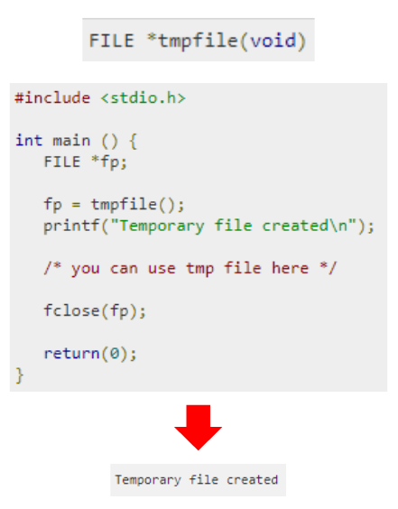

# Ficheiros I/O

## Ficheiros: Standard I/O, Texto e Binários

**Standard Input and Output**: O C trata todos os dispositivos como ficheiros. Na execução de um programa são automaticamente abertos 3 ficheiros conforme indicado na tabela, respectivamente, para entrada, saída e apresentação de mensagens de erro.



**Ficheiros em Geral**: O C trata todos os dispositivos como ficheiros. Os ficheiros representam a informação por uma sequência de bytes independentemente de serem **ficheiros de texto** ou **ficheiros binários**.

## Funções: 

### fopen() e fclose()
A função **fopen()** permite abrir/aceder a um ficheiro especificado pela stringfilenameno *modo* especificado pela stringmode. A função **fopen()** retorna um apontador para FILE (apontador para o inicio do ficheiro) e NULL em caso de erro.

A função **fclose()** permite fechar um ficheiro especificado pela string *filename*. A função **fclose()** retorna 0 em caso de sucesso ou EOF em caso de falha.



### freopen()
A função **freopen()** permite associar um ficheiro especificado pela string *filename* no modo especificado pela stringmodeao stream especificado. A função **freopen()** retorna um apontador para FILE (apontador para o inicio do ficheiro) e NULL em caso de erro. Para o caso de ficheiros binários acrescenta-se “b” na especificação do modo.

```c
FILE *freopen(const char *filename, const char *mode, FILE *stream)
```

### fprintf()
A função **fprintf()** permite enviar dados formatados, de acordo com a stringformat, para um ficheiro especificado pelo apontador *stream* para FILE. A formatação, tal como o printf(), segue a estrutura **%[flags][width][.precision][length] specifier**. 

A função fprintf() retorna, em caso de sucesso, o número de caracteres escritos, caso contrário, retorna um valor negativo.

```c
int fprintf(FILE *stream, const char *format)
```



### fputc()
A função **fputc()** escreve o caráter especificado por charno ficheiro apontado por *stream* e avança uma posição. Retorna o caráter que foi escrito ou EOF se ocorrer um erro.

```c
int fputsc(int char, FILE *name)
```

### fputs()
A função **fputs()** escreve uma string especificada por strno ficheiro apontado por *stream* sem incluir o caráter de fim de string. Retorna um valor não negativo ou EOF se ocorrer um erro.

```c
int fgetc(FILE *stream)
```

### fgets()
A função **fgets()** lê uma string para str. A função para quando lê n-1 caracteres, newlineou fim de ficheiro (EOF). Retorna a stringou NULL em caso de erro. 

```c
int fgets(char *str, FILE *stream)
```

### fscanf()
A função **fscanf()** permite ler dados formatados, de acordo com a string *format*, de um ficheiro especificado pelo apontador *stream* para FILE. A formatação, tal como o scanf(), segue a estrutura **[=%[*][width][modifiers]type=]** A função **fscanf()** retorna o número de variáveis lidas.

```c
int fscanf(FILE *stream, const char *format, ...)
```

### feof() e ferror()
A função **feof()** testa o indicador de EOF para um determinado *stream*, apontador para ficheiro que identifica o *stream*. A função feof() retorna um valor diferente de zero se quando o EOF está associado ao stream, isto é aponta para o fim do ficheiro, caso contrário retorna 0.
A função **ferror()** testa o indicador de erro para um determinado *stream*, apontador para ficheiro que identifica o *stream*. A função **ferror()** retorna um valor diferente de zero em caso de erro associado ao *stream*, caso contrário retorna 0.



### fwrite()
A função **fwrite()** permite escrever um bloco de dados de um array apontado por *ptr*. A função **fwrite()** retorna, em caso de sucesso, o número de elementos escritos.

```c
int fscanf(const void *ptr, size_t nmemb, FILE *stream)
```

- **ptr**- This is the pointer to the array of elements to be written.
- **size** -This is the size of elements, each one with the size of **size** bytes.
- **stream** - This is the pointer to a FILE object that specifies an output stream.

### fseek()
A função **fseek()** permite colocar o *stream* a apontar para uma determinada posição do ficheiro. A função **fseek()** retorna 0 em caso de sucesso ou não zero em caso de insucesso.



### fread()
A função **fwrite()** permite escrever um bloco de dados de um arrayapontado por *ptr*. A função **fwrite()** retorna, em caso de sucesso, o número de elementos escritos.



### ftell()
A função **ftell()** devolve a posição do apontador *stream* para FILE. A função **ftell()** retorna, em caso de sucesso, a posição do apontador e se ocorre um erro é devolvido -1 e a variável global errno recebe um valor positivo.

```c
long int ftell(FILE *stream)
```



### fgetpos()
A função **fgetpos()** permite obter a posição actual do apontador para o ficheiro e escreve-o *pos*. A função **fgetpos()** retorna 0 em caso de sucesso, caso contrário, retorna um valor diferente de zero.


```c
int fgetpos(FILE *stream, fpos_t *pos)
```

### fsetpos()
A função **fsetpos()** permite posicionar o apontador para o ficheiro na posição indicada por *pos*. A função **fgetpos()** retorna 0 em caso de sucesso, caso contrário, retorna um valor diferente de zero. 

```c
int fsetpos(FILE *stream, const fpos_t *pos)
```



### rewind()
A função **rewind()** permite colocar o apontador para o ficheiro a apontar para o começo do ficheiro. A função **rewind()** não retorna qualquer valor. 



### tmpfile()
A função **tmpfile()** cria um ficheiro temporário em modo “wb+” e retorna um apontador para o ficheiro ou NULL em caso de erro. 

```c
FILE *tmpfile(void)
```

