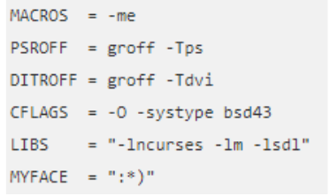
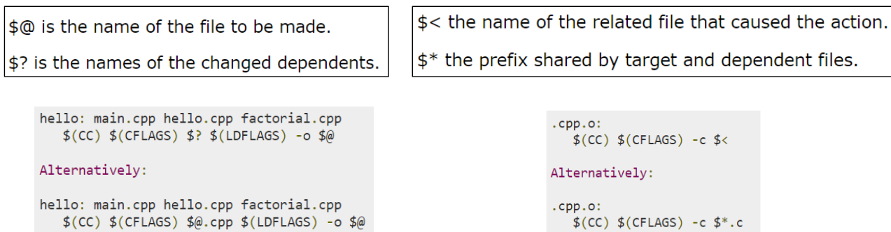
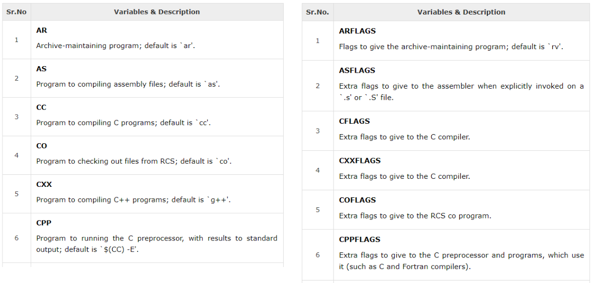
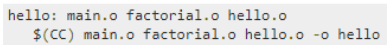
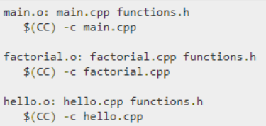
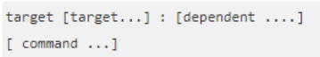
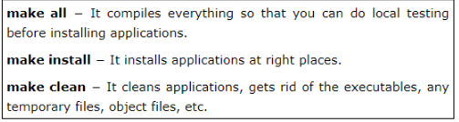
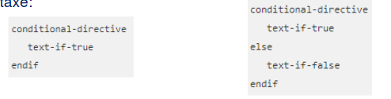
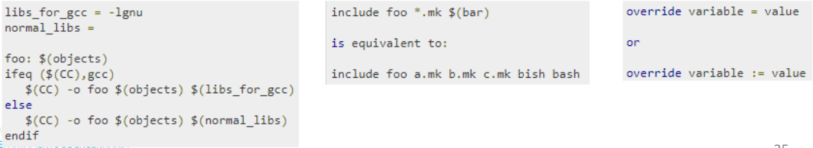

# Projecto com Múltiplos Ficheiros e Makefiles

## MAKE e MAKEFILES

O comando **make** do Unix/Linux facilita a geração do executável de programas com base nas diretrizes definidas num ficheiro **Makefile** (ou outro especificado com a opção **–f**. A utilização de makefilesé particularmente útil quando estão presentes vários módulos de um projecto. Nos slides seguintes, apresentam-se algumas primitivas para construção das makefiles. Sugere-se a consulta do manual do comando **make**.

### Macros

O comando **make** permite a definição de Macros conforme ilustrado conferindo uma maior clareza e facilidade de actualização/manutenção das makefiles.

existem ainda Macros pre-definidas(exemplo com ficheiros em cpp):

Existem inúmeras macros pre-definidasque se dividem em 2 categorias (pode consultar a lista completa utilizando o comando make–p):

•Nomes de programas
•Argumentos para programas 

### Dependências
Normalmente, a geração do executável tem várias dependências de outros ficheiros e isso deve ser indicado na makefile. (exemplo com ficheiros em cpp, idêntico em c) 

Deve ainda ser indicado como é que se obtêm esses ficheiros.

### Regras
A sintaxe das regras definidas nas makefilessegue o seguinte formato:

Por exemplo, define-se o comando com o *target* **hello** tendo as dependências de **main.o** **factorial.o** e **hello.o**

é comum a definição de alguns targetscomo (mas deve ser sempre verificado antes da utilização de um makefile).

### Directivas

Podem ainda ser utilizadas directivas **condicionais**, de **include** e de **override**. As directivas condicionais são **ifeq**, **ifneq**, **ifdef**, **ifndef**, **else**, **endife** seguem a seguinte sintaxe:

**ifeq** e **ifneq** comparam 2 argumentos verificando se são ou não iguais.

**Ifdef** e **ifndef** verificam se o único argumento é verdadeiro ou falso.

**else** e **endif** utilizam em conjunto com as anteriores directivaspara especificar alternativa offim da directiva.

As directivas **include** e **override** permitem a inclusão de outros ficheiros (como makefiles) e a atribuição de um avalora uma variável definida previamente por um comando de uma variável.  

