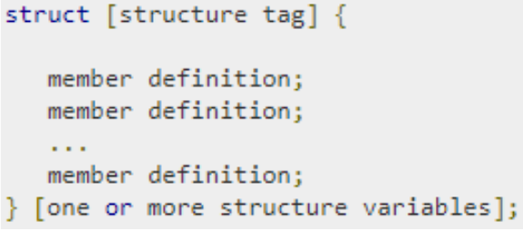
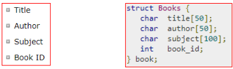
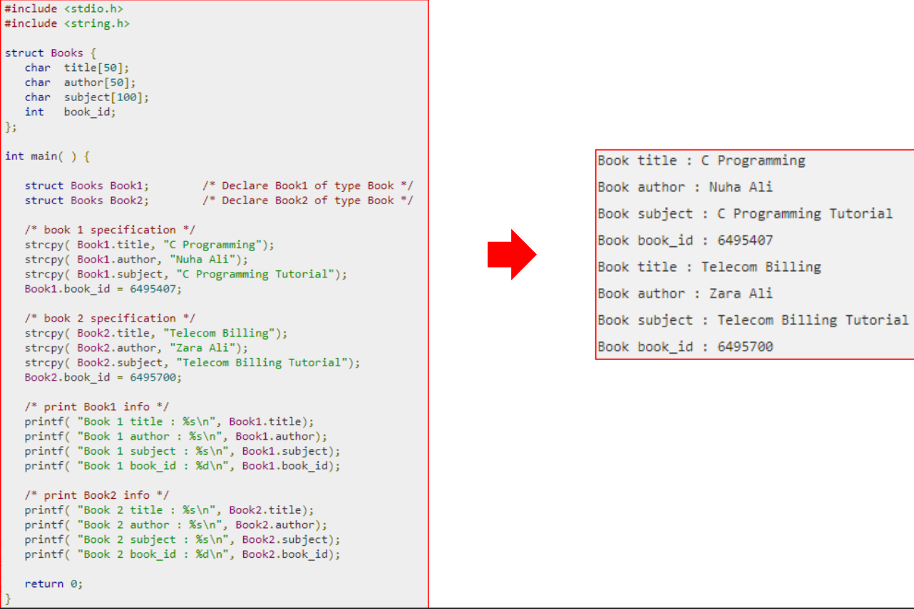
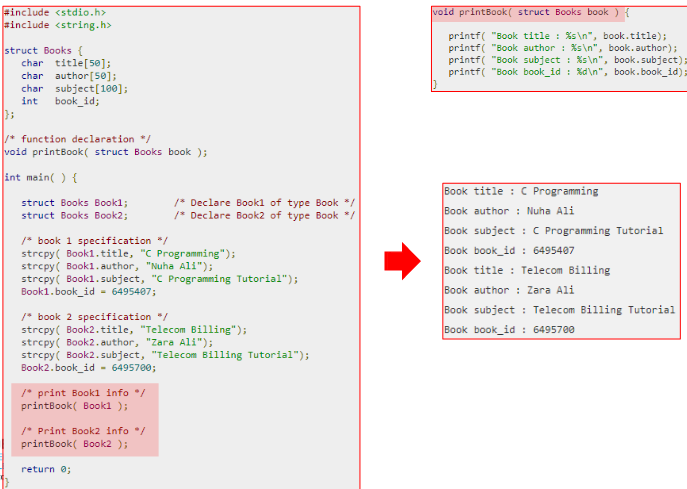
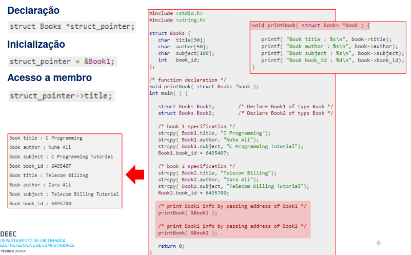
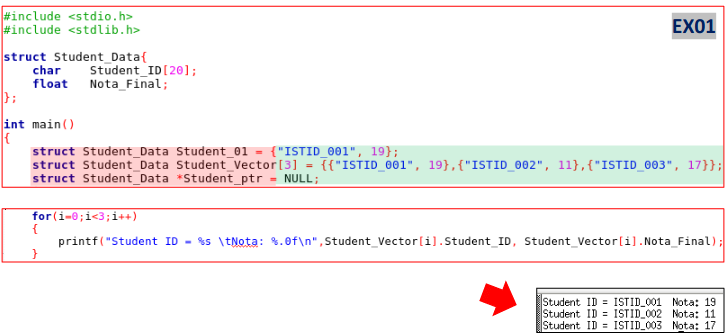
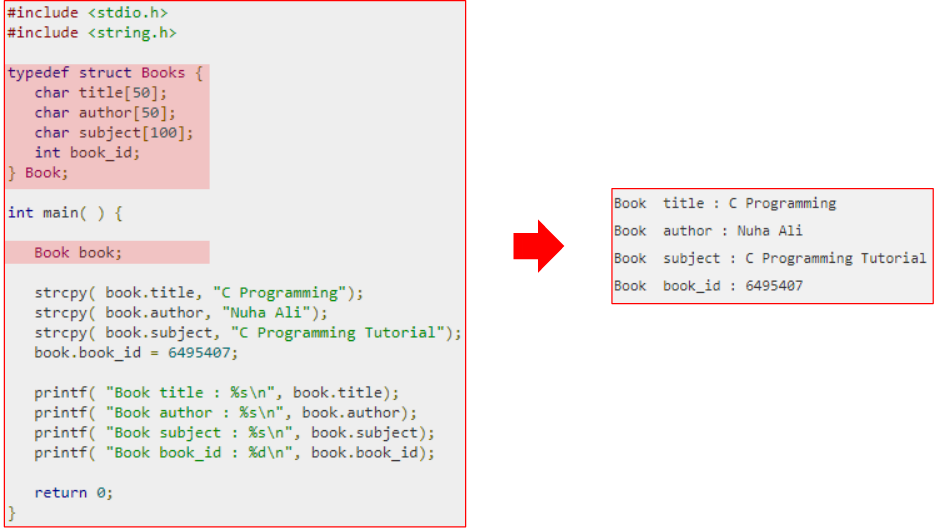
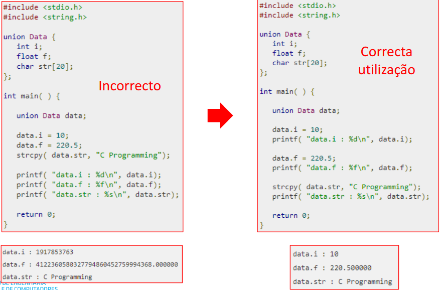
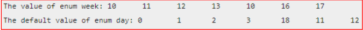

# Estruturas, Uniões, Enumerados e typedef

## Estruturas (struct)
As estruturas (**struct**) são um tipo de dados derivado definido pelo utilizador que pode combinar membros (**member**) de diferentes tipos de dados. 

O formato geral para definição de uma estrutura é o seguinte:


**structure tag** é opcional e permite atribuir um nome à estrutura definida

**member definition** corresponde à definição de variáveis que compõem a estrutura 

**structure variables** corresponde à definição de variáveis do tipo de estrutura definido.



### Acesso a Membros

O acesso a membros de uma estrutura faz-se com recurso ao operador(.). O acesso a um determina do membro faz-se colocando o operador entre a variável do tipo da estrutura e a designação do membro ao qual sequer aceder. Por exemplo, **Book1.title** para aceder à variável **title** pertencente à estrutura **Book1**.



### Argumentos para Funções

As estruturas podem ser passadas como argumentos para funções tal como outras variáveis ou apontadores.



### Apontadores para Estruturas
Podem-se definir apontadores para estruturas tal como se definem para qualquer outra variável.



### Declaração e Inicialização

A `declaração` pode ser realizada de forma semelhante aos outros tipos, por exemplo, um variável do tipo estrutura um vector de estruturas ou um apontador para estruturas.

A `inicialização` pode ser realizada na declaração ou no correr do programa.



## Definição de Tipos (typedef)
A palavra chave do C **typedef** pode ser utilizada para atribuir outro nome ou para definir nomes para tipos de dados definidos pelo utilizador, permitindo, por exemplo, a declaração de variáveis desse novo tipo sem recurso à palavra chave **struct**. A definição de novos tipos deve (boa prática) ser incluída nos ficheiros .h.



## Uniões 
A União (**union**) é um tipo de dados especial definido no C que permite armazenar diferentes tipo de dados na mesma localização de memória. Tal com as estruturas as uniões podem ter vários membros mas apenas um membro pode conter um valor em cada instante. As uniões são uma forma eficiente de utilizar a mesma localização de memória para diferentes propósitos. A definição segue o seguinte formato:

```c
union [union tag] {
    member definition;
    member definition;
    ...
    member definition;
} [one or more union variables];
```

**union tag** é opcional e permite atribuir um nome à união definida 

**member definition** corresponde à definição de variáveis que compõem a união

**union variables** corresponde à definição de variáveis do tipo de união definido.

```c
union Data {
    int i;
    float f;
    char str[20];
} data;
```

```c
#include <stdio.h>
#include <string.h>

union Data {
    int i;
    float f;
    char str[20];
};

int main() {
    union Data data;
    printf("Memory size occupied by data: %d\n", sizeof(data));

    return 0;
}
```

`    A memória reservada corresponde à dimensão do maior membro:`
```
Memory size occupied by data: 20
```

### Acesso a Membros
O acesso a membros de uma união faz-se com recurso ao operador (.). O acesso a um determinado membro faz-se colocando o operador entre a variável do tipo da união e a designação do membro ao qual se quer aceder. Porexemplo, **data.f** para aceder à variável **f** pertencente à união **data**.



## Enumerados
O tipo enumerado (**enum**) é mais um tipo de dados definido pelo utilizador em C. O tipo enumerado permite limitar o valor de uma variável a um conjunto restrito de valores. A definição segue o seguinte formato:

```c
enum enum_name{const1, const2, ...};
```

**enum_name** é nome atribuído ao tipo enumerado

**const1..N** são os valores permitidos (domínio) da variável enumerada. Nota, **const1** é uma constante com o valor 0 e as seguintes são incrementadas de uma unidade a não ser que inicializadas com outro valor.

```c
#include <stdio.h>

enum week{Mon=10, Tue, Wed, Thur, Fri=10, Sat=16, Sun};

enum day{Mond, Tues, Wedn, Thurs, Frid=18, Satu=11, Sund};

int main() {
    printf("The value of enum week: %d\t%d\t%d\t%d\t%d\t%d\t%d\n\n", Mon, Tue, Wed, Thur, Fri, Sat, Sun);
    printf("The default value of enum day: %d\t%d\t%d\t%d\t%d\t%d\t%d\n\n", Mon, Tues, Wedn, Thurs, Frid, Satu, Sund);
    return 0;
}
```



```c
enum week{sunday, monday, tuesday, wednesday, thursday, wednesday, thursday, friday, saturday};

enum week day;
```

```c
enum boolean { false, true };
enum boolean check;
```

```c
enum boolean { 
    false, true 
    } check;
```