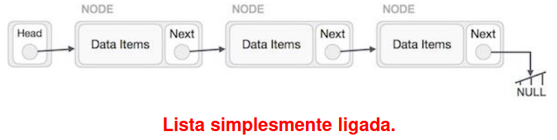
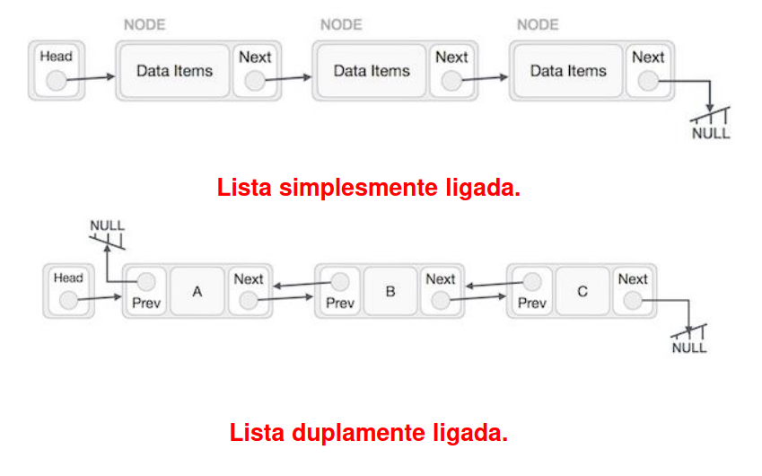
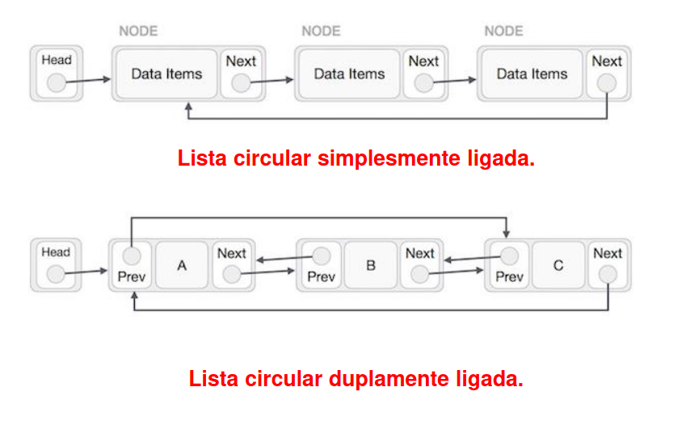
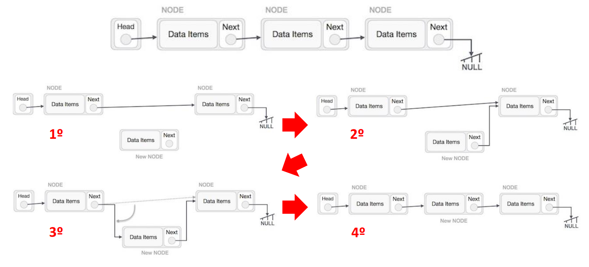
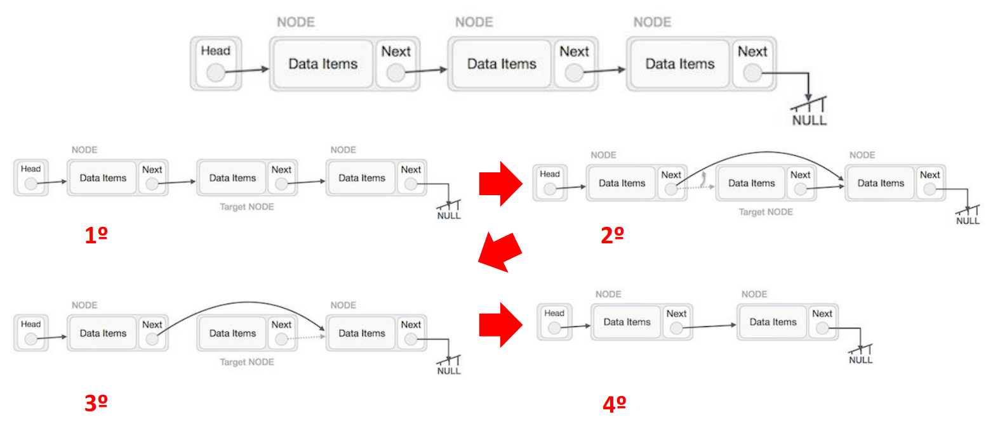

# Listas, Stacks, Filas
## Listas Dinâmicas
**Listas dinâmicas** correspondem a uma **coleção de dados** criados dinamicamente em que cada elemento dispõe de um **apontador para o elemento seguinte**.

Cada **elemento da lista** é constituído por **zona de armazenamento de dados** e de um **apontador para o próximo** elemento.

Para **criar uma lista** é necessário **criar um tipo de dados** e **criar uma variável que designada base, cabeça ou raiz** que aponta para o primeiro elemento da lista.

Nas listas dinâmicas a **sequência dos elementos é apenas definida pelos apontadores de cada elemento**, independentemente do endereço de memória ocupado.

## Listas
### Inserção
A inserção de elementos numa lista (neste caso lista simplesmente ligada) deve ser realizada de modo a manter a ligação entre todos os elementos da lista.

### Remoção
A remoção de elementos numa lista (neste caso lista simplesmente ligada) deve ser realizada de modo a manter a ligação entre todos os elementos da lista.

